# 5G4Data Tutorial - Architecture Diagram

```mermaid
graph TB
    subgraph "External"
        User[👤 User]
        Internet[🌐 Internet]
    end

    subgraph "Docker Host"
        subgraph "Internal Network"
            subgraph "reverse-proxy"
                Caddy[🔒 Caddy Proxy<br/>Port: 443<br/>caddy:latest]
            end
            
            subgraph "flask-app"
                Flask[🐍 Flask App<br/>Port: 5003<br/>Python 3.12]
            end
            
            subgraph "webapp"
                WebApp[⚛️ Workload Catalog<br/>Port: 3000<br/>5g4data-tutorial-workload-catalog]
            end
            
            subgraph "chartmuseum"
                ChartMuseum[📊 ChartMuseum<br/>Port: 8080<br/>chartmuseum:latest]
            end
        end
        
        subgraph "Volumes"
            CaddyFile[📄 Caddyfile]
            Certs[🔐 certs/]
            Charts[📈 charts/]
        end
    end

    %% External connections
    User --> Internet
    Internet -->|"HTTPS :443"| Caddy

    %% Volume mounts
    CaddyFile -.-> Caddy
    Certs -.-> Caddy
    Charts -.-> ChartMuseum

    %% Internal routing
    Caddy -->|"/"| Flask
    Caddy -->|"/webapp/*"| WebApp
    Caddy -->|"/charts/*"| ChartMuseum
    
    %% Service dependencies
    WebApp -->|"API calls"| ChartMuseum

    %% Styling
    classDef container fill:#e1f5fe,stroke:#01579b,stroke-width:2px
    classDef proxy fill:#f3e5f5,stroke:#4a148c,stroke-width:2px
    classDef volume fill:#fff3e0,stroke:#e65100,stroke-width:2px
    classDef external fill:#e8f5e8,stroke:#2e7d32,stroke-width:2px

    class Flask,WebApp,ChartMuseum container
    class Caddy proxy
    class CaddyFile,Certs,Charts volume
    class User,Internet external
```

## Architecture Overview

### Components

1. **Caddy Reverse Proxy** (reverse-proxy)
   - Acts as HTTPS terminator and load balancer
   - Routes traffic based on path prefixes
   - Handles SSL/TLS certificates
   - External port: 443

2. **Flask Application** (flask-app)
   - Main 5G4Data tutorial application
   - Python 3.12 with Gunicorn WSGI server
   - Serves the primary web interface
   - Internal port: 5003

3. **Workload Catalog WebApp** (webapp)
   - Go/Fiber application for workload management
   - Communicates with ChartMuseum for Helm charts
   - Internal port: 3000

4. **ChartMuseum** (chartmuseum)
   - Helm chart repository server
   - Stores and serves Kubernetes workload definitions
   - Internal port: 8080

### Network Configuration

- **Internal Network**: `app-network` (5g4data-tutorial-app-network)
- All containers communicate within this isolated Docker network
- Service discovery via container names

### Routing Rules

| Path | Target Service | Internal URL |
|------|---------------|--------------|
| `/` | Flask App | `flask-app:5003` |
| `/webapp/*` | WebApp | `webapp:3000` |
| `/charts/*` | ChartMuseum | `chartmuseum:8080` |

### Security

- HTTPS termination at Caddy proxy
- SSL certificates mounted from host
- Internal communication over HTTP within Docker network
- External access only through Caddy on port 443