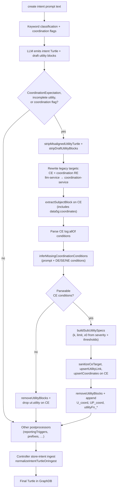
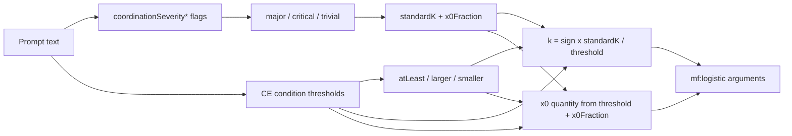

# Generation of CoordinationExpectation in intents (using the Controller Studio)

This guide explains how to activate **inCoord-compatible CoordinationExpectation** in intents when authoring Controller scripts, and how the **utility functions** that drive coordination are generated. 

Generation of a CoordinationExpectation in an intent is triggered by natural-language phrases inside the quoted `prompt "…"` on a `create intent` line. Example:

```text
create intent using intentGen storage prometheus prompt "Deploy a small llm in a datacenter near Tromsø/Norway with symmetric coordination on token throughput and energy consumption" as llmIntent
```

## Overview

When coordination is requested, the intent-generating agent adds:

- a `**data5g:CoordinationExpectation`** (`icm:target data5g:coordination-service`)
- coordination **conditions** (one per coordinated metric)
- a **utility function** (`ut:UtilityInformation` + `fun:function` summing sub-utilities)
- `**data5g:coordinates`** linking the coordination expectation to the expectation(s) that own the coordinated metrics (deployment, sustainability, and/or network)
- an `**icm:ObservationReportingExpectation`** for target `data5g:coordination-service`

This format is required for [inCoord](https://github.com/INTEND-Project/inCoord-Private) integration testing.

## How activation works

```text
create intent using intentGen storage prometheus prompt "<your natural language here>" as myIntent
```

Include coordination phrases in `<your natural language here>`. The agent classifies the prompt and includes coordination structures in the generated Turtle.

## Trigger phrase reference


| Goal                | Example phrases in prompt                                     |
| ------------------- | ------------------------------------------------------------- |
| Enable coordination | `coordination`, `coordinate`, `inCoord`                       |
| Equal weighting     | `symmetric coordination`, `equal weight`                      |
| Unequal weighting   | `weighted coordination`, `prioritize … over …`                |
| Strictness          | `critical` / `strict`, `trivial` / `lenient` (default: major) |


If, for some strange reason, both symmetric and weighted phrases appear, **weighted** takes precedence.

## Prompt recipes

Symmetric coordination on throughput and energy consumption:

```text
create intent using intentGen storage prometheus prompt "Deploy a small LLM near Tromsø with symmetric coordination on token throughput and energy consumption" as llmIntent
```

Weighted coordination prioritizing latency:

```text
create intent using intentGen storage prometheus prompt "Deploy LLM with weighted coordination prioritizing p99 latency over energy consumption, critical severity" as llmIntent
```

## Choosing coordination metrics

Name the metrics you want coordinated in the prompt (throughput, latency, energy consumption, watts, etc.). The agent:

1. Creates one **condition** per coordinated metric under the coordination expectation.
2. Creates matching utility arguments `U_arg_<metric-stem>` wired via `ut:forMetric`.

Example metric stems (retrieved from Workload catalogue helm charts/values.yaml): `p99-token-target`, `energy-consumption`, `power-consumption`, `networklatency`, `p99_computelatency`. Prompts that mention energy consumption typically coordinate on `energy-consumption` (joules) from the workload catalogue. The coordination utility postprocessor aligns CE metric references with catalogue stems and can infer a missing second coordinated metric from the user prompt plus deployment/sustainability conditions.

## Tips

- Combine deployment, sustainability, network, and coordination requirements in one prompt as needed.
- `data5g:coordinates` links to the expectations that own the coordinated metrics—for example deployment + sustainability for throughput/energy coordination. **Network** is included only when coordinated metrics are network-related (latency, bandwidth) or the prompt explicitly requests network QoS.
- Use `storage prometheus` when you plan to store observations in Prometheus (TBD if it is needed).

## Utility function resources

When coordination is enabled, the intent-generation agent emits a draft utility block (using a gen-AI model). A **postprocessor** then replaces that draft with canonical Turtle if it is malformed:


| Resource                     | Role                                                                                            |
| ---------------------------- | ----------------------------------------------------------------------------------------------- |
| `data5g:U_coord`             | `ut:UtilityInformation` — wires utility arguments to coordination conditions via `ut:forMetric` |
| `data5g:UP_coord`            | `ut:UtilityProfile` — min/max utility bounds (typically 0.0–1.0)                                |
| `data5g:utilityFn_<profile>` | `fun:function` — sums one sub-utility per coordinated metric                                    |


Each sub-utility is typically an `mf:logistic` call (or `mf:poly` for secondary energy metrics in weighted profiles).

### Reference examples

These Turtle files show **postprocessor-canonical** coordination output (complete four-argument `mf:logistic` calls, `icm:target data5g:coordination-service` on both CE and coordination RE). They are metric-specific patterns, not copy-paste templates.


| Example                                                                    | Profile   | Coordinated metrics (in that file)     | Notes                                                               |
| -------------------------------------------------------------------------- | --------- | -------------------------------------- | ------------------------------------------------------------------- |
| `[intent_utility_symmetric.ttl](../examples/intent_utility_symmetric.ttl)` | symmetric | throughput (`p99-tps-target`) + energy | equal `limit` (0.5 each); both metrics use `mf:logistic`            |
| `[intent_utility_weighted.ttl](../examples/intent_utility_weighted.ttl)`   | weighted  | throughput + energy                    | higher throughput `limit` (0.7); energy uses `mf:poly` as secondary |


In both files:

- `data5g:CoordinationExpectation` targets `data5g:coordination-service` and lists coordinated expectations under `data5g:coordinates`.
- `icm:ObservationReportingExpectation` for coordination targets `data5g:coordination-service` (not `data5g:llm-service`).
- Utility argument locals follow the coordinated metric stems in that intent (for example `U_arg_tps`, `U_arg_energy-consumption`) — use `U_arg_<metric-stem>` for your own metrics.

The LLM may emit incomplete drafts; the coordination utility postprocessor replaces them with shapes like these before storage.

## Generation flow

The LLM may emit incomplete utility drafts (for example `mf:logistic` with only two arguments, or `ut:utility data5g:U_coord` with no `U_coord` subject). The coordination utility postprocessor in `[tools/postprocess/coordinationUtility.ts](../tools/postprocess/coordinationUtility.ts)` runs whenever a `CoordinationExpectation` is present, utility wiring is incomplete, or coordination was flagged in the prompt. It always regenerates canonical utility Turtle from parsed CE conditions (draft blocks are not kept). The same normalization runs again at Controller ingest (`normalizeIntentTurtleOnIngest` on `store-intent`) as a safety net before GraphDB write.




Numeric parameters (`k`, `limit`, `x0`) are **not** invented by the LLM. They are derived deterministically in `[tools/postprocess/coordinationUtilityDerive.ts](../tools/postprocess/coordinationUtilityDerive.ts)` from:

1. **Severity** — parsed from prompt keywords (`critical`, `trivial`, …)
2. **Condition thresholds** — metric targets the agent places in coordination conditions (from your prompt or workload catalogue hints)
3. **Quantifier** — `quan:atLeast`, `quan:larger`, or `quan:smaller` on each condition

## `mf:logistic` structure

Each sub-utility uses four arguments inside `mf:logistic`:

```turtle
mf:logistic (
    data5g:U_arg_<metric-stem>    # utility argument (metric)
    "0.03"^^xsd:decimal            # k — steepness; negative when smaller is better
    "0.5"^^xsd:decimal             # limit — sub-utility weight cap
    "340tokens/s"^^quan:quantity   # x0 — logistic midpoint as a quantity
)
```

Metadata on the surrounding blank node records the severity inputs used for derivation:

```turtle
data5g:standardK "12"^^xsd:decimal ;
data5g:x0Fraction "0.85"^^xsd:decimal
```

For `quan:smaller` conditions (for example energy consumption), **k is negative** because utility rises as the metric decreases.

## How k and x0 are computed




### Severity → `standardK` and `x0Fraction`


| Severity            | Trigger phrases in prompt       | `standardK` | `x0Fraction` |
| ------------------- | ------------------------------- | ----------- | ------------ |
| **major** (default) | *(none)*                        | 12          | 0.85         |
| **critical**        | `critical`, `critic`, `strict`  | 30          | 0.95         |
| **trivial**         | `trivial`, `lenient`, `relaxed` | 5           | 0.8          |


### Formulas

**k** (per metric):

```
k = + (standardK / threshold)   for quan:atLeast or quan:larger
k = - (standardK / threshold)   for quan:smaller
```

**x0** (midpoint quantity):

```
x0 = ceil(x0Fraction × threshold)              for atLeast / larger
x0 = ceil(threshold × (2 - x0Fraction))          for smaller
```

The unit string comes from the condition (`quan:unit`), for example `tokens/s` or `J`.

### Worked example (symmetric, major severity)

Conditions: throughput `quan:atLeast` 400 tokens/s; energy `quan:smaller` 10000 J.


| Metric     | k                                      | limit (symmetric, 2 metrics) | x0                             |
| ---------- | -------------------------------------- | ---------------------------- | ------------------------------ |
| Throughput | `+12/400` = `"0.03"^^xsd:decimal`      | `"0.5"^^xsd:decimal`         | `"340tokens/s"^^quan:quantity` |
| Energy     | `-12/10000` = `"-0.0012"^^xsd:decimal` | `"0.5"^^xsd:decimal`         | `"11500J"^^quan:quantity`      |


`limit` is controlled by **symmetric** vs **weighted** coordination phrases, not by severity. Symmetric splits utility equally (`0.5` each for two metrics); weighted assigns a higher limit to the prioritized metric.

## Prompt examples that change k and x0

You cannot set `k` or `x0` literally in the prompt (there is no `k=0.03` syntax). You influence them **indirectly** through severity phrases and condition thresholds.

### Default curves (major severity)

```text
create intent using intentGen storage prometheus prompt "Deploy a small LLM with symmetric coordination on token throughput and energy consumption" as llmIntent
```

Uses `standardK=12`, `x0Fraction=0.85`, and catalogue/default thresholds (for example 400 tokens/s, 10000 J).

### Stricter curves — steeper k, x0 closer to threshold

```text
create intent using intentGen storage prometheus prompt "Deploy LLM with symmetric coordination on token throughput and energy consumption, critical severity" as llmIntent
```

Effect: `standardK=30`, `x0Fraction=0.95` → larger |k| and midpoints nearer the bound (for example throughput x0 = `ceil(0.95 × 400)` = 380 tokens/s).

### Gentler curves — shallower k, x0 farther from threshold

```text
create intent using intentGen storage prometheus prompt "Deploy LLM with symmetric coordination on token throughput and energy consumption, trivial severity" as llmIntent
```

Effect: `standardK=5`, `x0Fraction=0.8` → smaller |k| and midpoints farther from the bound (for example throughput x0 = `ceil(0.8 × 400)` = 320 tokens/s).

### Change k and x0 via explicit thresholds

Thresholds in the prompt become condition `rdf:value` entries, which directly rescale k and x0:

```text
create intent using intentGen storage prometheus prompt "Deploy LLM with symmetric coordination: at least 600 tokens/s and energy consumption below 5000 J" as llmIntent
```

Compared with the 400 / 10000 J defaults (major severity):


| Metric                 | k change                           | x0 change               |
| ---------------------- | ---------------------------------- | ----------------------- |
| Throughput 600 token/s | `12/600` = 0.02 (was 0.03)         | `510tokens/s` (was 340) |
| Energy 5000 J          | `-12/5000` ≈ -0.0024 (was -0.0012) | `5750J` (was 11500)     |


### Combine severity and thresholds

```text
create intent using intentGen storage prometheus prompt "Deploy LLM with weighted coordination prioritizing token throughput over energy consumption, critical severity, at least 500 tokens/s, energy below 8000 J" as llmIntent
```

Effect:

- **critical** → `standardK=30`, `x0Fraction=0.95`
- **500 tokens/s** / **8000 J** → thresholds in k and x0 formulas
- **weighted** → throughput `limit` ≈ 0.7, energy ≈ 0.3 (energy may use `mf:poly` instead of `mf:logistic`)

## What the prompt does not control

- Direct numeric `k`, `x0`, or `x0Fraction` overrides per metric
- Per-metric severity (one severity level applies to all coordinated metrics)
- The four-argument shape of `mf:logistic` — the postprocessor always enforces `(metric, k, limit, x0)`

## Example of generated intent

For this "create intent ... " script line:

```text
create intent using intentGen storage prometheus prompt "Deploy a small llm in a datacenter near Tromsø/Norway with symmetric coordination on token throughput and energy consumption" as llmIntent
```

The generated intent is:

```turtle

@prefix data5g: <http://5g4data.eu/5g4data#> .
@prefix dct: <http://purl.org/dc/terms/> .
@prefix icm: <http://tio.models.tmforum.org/tio/v3.6.0/IntentCommonModel/> .
@prefix imo: <http://tio.models.tmforum.org/tio/v3.6.0/IntentManagementOntology/> .
@prefix log: <http://tio.models.tmforum.org/tio/v3.6.0/LogicalOperators/> .
@prefix mf: <http://tio.models.tmforum.org/tio/v3.6.0/MathFunctions/> .
@prefix fun: <http://tio.models.tmforum.org/tio/v3.6.0/FunctionOntology/> .
@prefix set: <http://tio.models.tmforum.org/tio/v3.6.0/SetOperators/> .
@prefix quan: <http://tio.models.tmforum.org/tio/v3.6.0/QuantityOntology/> .
@prefix rdf: <http://www.w3.org/1999/02/22-rdf-syntax-ns#> .
@prefix rdfs: <http://www.w3.org/2000/01/rdf-schema#> .
@prefix time: <http://tio.models.tmforum.org/tio/v3.8.0/TimeOntology/> .
@prefix ut: <http://tio.models.tmforum.org/tio/v3.6.0/Utility/> .
@prefix xsd: <http://www.w3.org/2001/XMLSchema#> .

data5g:I78316cafbf4e4195b1e668a6ebe6ab55 a icm:Intent ;
    dct:description "Deploy a small LLM near Tromsø with symmetric coordination between throughput and energy consumption." ;
    imo:handler "inSustain" ;
    imo:owner "inChat" ;
    log:allOf data5g:CEa2e3686c731f447391197c85b4b8d1b8, 
              data5g:DE21b3425e96b64195a1258d273db8df74, 
              data5g:RE2fcc86687ca14cbc8e6a090052bc3a50, 
              data5g:RE98eaffd6dbc1494389cc3b9a1834dbf4, 
              data5g:REa657d3238c244b8a9fca66ae1877b10b, 
              data5g:SE58b52d5c36ff421d8cc260f660f6a826 .

data5g:DE21b3425e96b64195a1258d273db8df74 a data5g:DeploymentExpectation,
    icm:Expectation,
    icm:IntentElement  ;
    dct:description "Deploy rusty-llm with required token throughput performance." ;
    icm:target data5g:deployment ;
    log:allOf data5g:COf85cf17329f54877a92e666e31290cd0, 
              data5g:CX1853574e1d5243a0989a0fde2c7b8f85 .

data5g:COf85cf17329f54877a92e666e31290cd0 a icm:Condition ;
    dct:description "p99-token-target condition quan:larger: 400 token/s" ;
    set:forAll [
        icm:valuesOfTargetProperty data5g:p99-token-target_COf85cf17329f54877a92e666e31290cd0 ;
        quan:larger [
            quan:unit "token/s" ;
            rdf:value 400
            ]
        ] .

data5g:CX1853574e1d5243a0989a0fde2c7b8f85 a icm:Context ;
    data5g:Application "rusty-llm" ;
    data5g:DataCenter "EC_31" ;
    data5g:DeploymentDescriptor "https://start5g-1.cs.uit.no/wchartmuseum/api/charts/rusty-llm/0.1.24" .

data5g:FiveMinuteReportEventDeployment_COf85cf17329f54877a92e666e31290cd0 a rdfs:Class ;
    imo:eventFor data5g:DE21b3425e96b64195a1258d273db8df74 ;
    time:delay ( data5g:lastReportInstant data5g:durationDeployment_COf85cf17329f54877a92e666e31290cd0 ) ;
    rdfs:subClassOf imo:Event .

data5g:durationDeployment_COf85cf17329f54877a92e666e31290cd0 a time:DurationDescription ;
    time:numericDuration 5.0 ;
    time:unitType time:unitMinute .

data5g:SE58b52d5c36ff421d8cc260f660f6a826 a data5g:SustainabilityExpectation,
    icm:Expectation,
    icm:IntentElement  ;
    dct:description "Ensure energy and power efficiency for deployed LLM." ;
    icm:target data5g:sustainability ;
    log:allOf data5g:COaabf568681044634b753bb67c88c5458, 
              data5g:COdc3520b3b28c4b169b54cf49cf66051b, 
              data5g:CX1853574e1d5243a0989a0fde2c7b8f85 .

data5g:COdc3520b3b28c4b169b54cf49cf66051b a icm:Condition ;
    dct:description "energy-consumption condition quan:smaller: 50 J" ;
    set:forAll [
        icm:valuesOfTargetProperty data5g:energy-consumption_COdc3520b3b28c4b169b54cf49cf66051b ;
        quan:smaller [
            quan:unit "J" ;
            rdf:value 50
            ]
        ] .

data5g:COaabf568681044634b753bb67c88c5458 a icm:Condition ;
    dct:description "power-consumption condition quan:smaller: 3000 W" ;
    set:forAll [
        icm:valuesOfTargetProperty data5g:power-consumption_COaabf568681044634b753bb67c88c5458 ;
        quan:smaller [
            quan:unit "W" ;
            rdf:value 3000
            ]
        ] .

data5g:FiveMinuteReportEventSustainability_COdc3520b3b28c4b169b54cf49cf66051b a rdfs:Class ;
    imo:eventFor data5g:SE58b52d5c36ff421d8cc260f660f6a826 ;
    time:delay ( data5g:lastReportInstant data5g:durationSustainability_COdc3520b3b28c4b169b54cf49cf66051b ) ;
    rdfs:subClassOf imo:Event .

data5g:durationSustainability_COdc3520b3b28c4b169b54cf49cf66051b a time:DurationDescription ;
    time:numericDuration 5.0 ;
    time:unitType time:unitMinute .

data5g:CEa2e3686c731f447391197c85b4b8d1b8 a data5g:CoordinationExpectation,
    icm:Expectation,
    icm:IntentElement  ;
    data5g:coordinates data5g:DE21b3425e96b64195a1258d273db8df74, 
                       data5g:SE58b52d5c36ff421d8cc260f660f6a826 ;
    dct:description "Symmetric coordination between throughput and energy consumption." ;
    icm:target data5g:coordination-service ;
    log:allOf data5g:CO8d68cd7c047a4a42a985b9f669542769, 
              data5g:CObc66582503484375a0f5b1d95f7f2328 ;
    ut:utility data5g:U_coord .

data5g:CO8d68cd7c047a4a42a985b9f669542769 a icm:Condition ;
    dct:description "Coordination condition on p99-token-target" ;
    set:forAll [
        icm:valuesOfTargetProperty data5g:p99-token-target_CO8d68cd7c047a4a42a985b9f669542769 ;
        quan:larger [
            quan:unit "token/s" ;
            rdf:value 400
            ]
        ] .

data5g:CObc66582503484375a0f5b1d95f7f2328 a icm:Condition ;
    dct:description "Coordination condition on energy-consumption" ;
    set:forAll [
        icm:valuesOfTargetProperty data5g:energy-consumption_CObc66582503484375a0f5b1d95f7f2328 ;
        quan:smaller [
            quan:unit "J" ;
            rdf:value 50
            ]
        ] .

data5g:FiveMinuteReportEventCoordination_CO8d68cd7c047a4a42a985b9f669542769 a rdfs:Class ;
    imo:eventFor data5g:CEa2e3686c731f447391197c85b4b8d1b8 ;
    time:delay ( data5g:lastReportInstant data5g:durationCoordination_CO8d68cd7c047a4a42a985b9f669542769 ) ;
    rdfs:subClassOf imo:Event .

data5g:durationCoordination_CO8d68cd7c047a4a42a985b9f669542769 a time:DurationDescription ;
    time:numericDuration 5.0 ;
    time:unitType time:unitMinute .

data5g:RE2fcc86687ca14cbc8e6a090052bc3a50 a icm:ObservationReportingExpectation ;
    dct:description "Deployment observation reports every 5 minutes to Prometheus." ;
    icm:reportDestinations [
        a rdfs:Container ;
        rdfs:member data5g:prometheus
        ]  ;
    icm:reportTriggers [
        a rdfs:Container ;
        rdfs:member data5g:FiveMinuteReportEventDeployment_COf85cf17329f54877a92e666e31290cd0
        ]  ;
    icm:target data5g:deployment .

data5g:RE98eaffd6dbc1494389cc3b9a1834dbf4 a icm:ObservationReportingExpectation ;
    dct:description "Sustainability observation reports every 5 minutes to Prometheus." ;
    icm:reportDestinations [
        a rdfs:Container ;
        rdfs:member data5g:prometheus
        ]  ;
    icm:reportTriggers [
        a rdfs:Container ;
        rdfs:member data5g:FiveMinuteReportEventSustainability_COdc3520b3b28c4b169b54cf49cf66051b
        ]  ;
    icm:target data5g:sustainability .

data5g:REa657d3238c244b8a9fca66ae1877b10b a icm:ObservationReportingExpectation ;
    dct:description "Coordination observation reports every 5 minutes to Prometheus." ;
    icm:reportDestinations [
        a rdfs:Container ;
        rdfs:member data5g:prometheus
        ]  ;
    icm:reportTriggers [
        a rdfs:Container ;
        rdfs:member data5g:FiveMinuteReportEventCoordination_CO8d68cd7c047a4a42a985b9f669542769
        ]  ;
    icm:target data5g:coordination-service .

data5g:U_coord a ut:UtilityInformation ;
    ut:forMetric ( data5g:U_arg_p99-token-target data5g:p99-token-target_CO8d68cd7c047a4a42a985b9f669542769 ), ( data5g:U_arg_energy-consumption data5g:energy-consumption_CObc66582503484375a0f5b1d95f7f2328 ) ;
    ut:function data5g:utilityFn_symmetric ;
    ut:utilityProfile data5g:UP_coord ;
    ut:withArguments ( data5g:U_arg_p99-token-target data5g:U_arg_energy-consumption ) .

data5g:UP_coord a ut:UtilityProfile ;
    ut:maxUtility "1.0"^^xsd:decimal ;
    ut:minUtility "0.0"^^xsd:decimal .

data5g:utilityFn_symmetric a fun:function ;
    fun:argumentNames ( data5g:U_arg_p99-token-target data5g:U_arg_energy-consumption ) ;
    fun:argumentTypes ( quan:Quantity ) ;
    fun:arityMax 2 ;
    fun:arityMin 2 ;
    fun:resultType quan:Quantity ;
    rdf:value [
        quan:sum ( [
            data5g:standardK "12.0"^^xsd:decimal ;
            data5g:x0Fraction "0.85"^^xsd:decimal ;
            mf:logistic ( data5g:U_arg_p99-token-target "0.03"^^xsd:decimal "0.5"^^xsd:decimal "340token/s"^^quan:quantity )
            ] [
            data5g:standardK "12.0"^^xsd:decimal ;
            data5g:x0Fraction "0.85"^^xsd:decimal ;
            mf:logistic ( data5g:U_arg_energy-consumption "-0.24"^^xsd:decimal "0.5"^^xsd:decimal "58J"^^quan:quantity )
            ] )
        ] .
```

