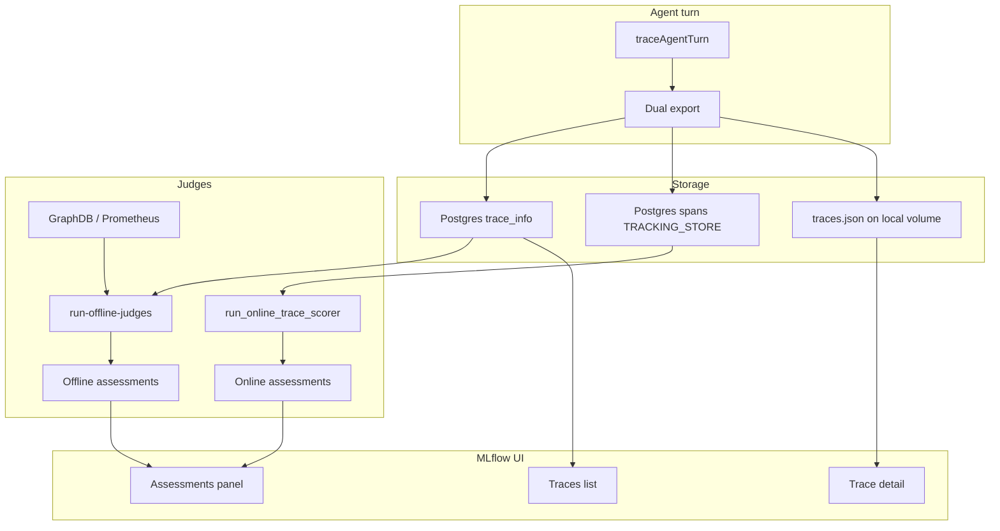

# MLflow observability and judges (5G4Data agents)

End-to-end guide for how SimulatorAgentKernel agents export traces, how online and offline judges score them, and where data is stored. For stack setup see [mlflow/docker-compose/README.md](mlflow/docker-compose/README.md). For judge YAML and CLI see [mlflow/judges/README.md](mlflow/judges/README.md).

## Overview

Each agent turn produces one **MLflow trace** in a per-agent experiment:

| Experiment | Agent | Online judges |
|------------|-------|---------------|
| `5g4data-intent-generating-agent` | Intent generation | Auto-run on new traces |
| `5g4data-intent-generating-agent-mistral-small4` | Intent generation (e1 package) | Registered for manual runs only |
| `5g4data-intent-observation-generating-agent` | Observation generation | Auto-run on new traces |

Quality checks run in two ways:

- **Online judges** — LLM scorers registered on the experiment; MLflow runs them automatically on ingested traces (except `5g4data-intent-generating-agent-mistral-small4`, where judges are registered but not started — run them manually from the trace UI).
- **Offline judges** — Node/Python scripts that verify persisted artifacts (GraphDB Turtle, Prometheus series) and attach assessments to the same trace.



## How agents create traces

Tracing is implemented in [`SimulatorAgentKernel/src/tracing/mlflowTracing.ts`](SimulatorAgentKernel/src/tracing/mlflowTracing.ts). Each turn wrapped by `traceAgentTurn` exports:

- Root **AGENT** span (`agent_turn`) with user input, response, session/turn IDs
- Nested **LLM** spans (`llm_main_turn`, `llm_repair`, …) with token usage
- **TOOL** spans (SHACL validation, GraphDB persistence, …)
- Tags: `agent.name`, `package.name`, `turn.path`, intent flags, etc.

### Environment variables

| Variable | Purpose |
|----------|---------|
| `MLFLOW_TRACKING_URI` | Internal URI, e.g. `http://mlflow:5000/mlflow` |
| `MLFLOW_EXPERIMENT_NAME` | Experiment name (one per agent clone) |
| `MLFLOW_EXPERIMENT_DESCRIPTION` | Optional note stored as `mlflow.note.content` on the experiment |
| `MLFLOW_EXPERIMENT_ID` | Optional; name is preferred |
| `MLFLOW_TRACING_ENABLED` | `false` disables export |
| `MLFLOW_TRACKING_STORE_EXPORT_ENABLED` | `false` disables OTLP write to Postgres (breaks online judges; default `true`) |

### Trace correlation

The kernel returns `mlflowTraceId` on each A2A turn. The Controller forwards it to `store-intent` so offline intent judges can attach assessments to the correct trace.

### Dual export (artifact + tracking store)

The TypeScript `mlflow-tracing` SDK uploads span bodies to **artifact storage** by default. Online judges require spans in **Postgres** (`TRACKING_STORE`). The kernel patches the SDK to also send spans via **OTLP** to the MLflow server root (not under the `/mlflow` API prefix):

```http
POST {origin(MLFLOW_TRACKING_URI)}/v1/traces
x-mlflow-experiment-id: {experimentId}
```

Example: tracking URI `http://mlflow:5000/mlflow` → OTLP `http://mlflow:5000/v1/traces`.

Implementation: [`mlflowCompositeProvider.ts`](SimulatorAgentKernel/src/tracing/mlflowCompositeProvider.ts) + [`flushCompositeTraces`](SimulatorAgentKernel/src/tracing/mlflowCompositeProvider.ts) (flushes both artifact and OTLP processors). SDK init is hooked via [`mlflowProviderPatch.ts`](SimulatorAgentKernel/src/tracing/mlflowProviderPatch.ts).

## Where trace data is stored

| Layer | Location | Contents | Used by |
|-------|----------|----------|---------|
| Trace index | Postgres `trace_info`, `trace_tags`, `assessments` | ID, previews, tags, assessments | UI list, offline judges |
| Span bodies (TRACKING_STORE) | Postgres `spans` + tag `mlflow.trace.spansLocation=TRACKING_STORE` | Full inputs/outputs, LLM/tool spans | **Online judges** |
| Span bodies (artifact copy) | `traces.json` under `file:///mlartifacts` (Docker volume) | Same payload, backup for UI | Trace detail view |

**Online judges only read TRACKING_STORE spans.** Artifact-only traces show in the UI but fail online scoring with `Trace data not stored in tracking store`.

### Local same-server layout

[`mlflow/docker-compose`](mlflow/docker-compose/) runs:

- **PostgreSQL** (`mlflow-postgres`) — metadata, spans, assessments
- **MLflow server** (`mlflow-server`) — API, UI, artifact proxy
- **Docker volume** `mlflow-artifacts` mounted at `/mlartifacts` — local artifact files (no S3/RustFS required)

## Online judges

Provisioned by [`mlflow/judges/provision-judges.mjs`](mlflow/judges/provision-judges.mjs) (or the `provision-judges` init container when `OPENAI_API_KEY` is set in `mlflow/docker-compose/.env`).

- Definitions: YAML under [`mlflow/judges/intent-generation/`](mlflow/judges/intent-generation/) and [`mlflow/judges/observation/`](mlflow/judges/observation/)
- Gateway: `agent-judge-gateway` (OpenAI via MLflow AI Gateway)
- Execution: background job `run_online_trace_scorer` on each experiment

### Intent judge I/O contract (`test_intent_coverage`)

Multi-turn intent sessions produce **one trace per A2A turn**. The Turtle turn exports a canonical root-span contract so online judges can use `{{ inputs }}` / `{{ outputs }}` directly (no `{{ trace }}` agentic mode):

| MLflow template | Root span field | Content |
|-----------------|-----------------|---------|
| `{{ inputs }}` | `agent_turn` inputs | **string** — substantive user requirement (`effectiveUserText`) |
| `{{ outputs }}` | `agent_turn` outputs | **JSON** — `requirementText`, `generatedResponse`, `turtlePresent`, `confirmationAck`, `warnings`, plus on Turtle turns `shaclConforms`, `shaclViolationCount`, `shaclReport`, `graphdbPersisted`, `graphdbIntentId` |

Review turns (no Turtle) set tag `intent.turtle_present=false` and export `turtlePresent: false` in root-span outputs. The scheduled judge filter `tags.intent.turtle_present = "true"` skips them automatically; when invoked manually on mixed traces, the judge must score **1.0** (not applicable). Definition: [`mlflow/judges/intent-generation/test-judge.yaml`](mlflow/judges/intent-generation/test-judge.yaml).

### SHACL / GraphDB judge (`intent_no_shacl_graphdb_errors`)

Enabled by default with `test_intent_coverage` via `MLFLOW_ONLINE_JUDGES_ONLY`. Runs only on Turtle turns (`tags.intent.turtle_present = "true"`). Fails when `shaclConforms` is false, `shaclViolationCount` > 0, verbose SHACL warnings appear, or GraphDB persistence failed. Definition: [`mlflow/judges/intent-generation/expectations.yaml`](mlflow/judges/intent-generation/expectations.yaml).

Example assessment names:

- Intent: `test_intent_coverage`, `intent_no_shacl_graphdb_errors`, `intent_forbidden_phrases`, …
- Observation: `observation_instruction_adherence`, `observation_codegen_quality`, …

## Offline judges

Run after external artifacts exist:

| Trigger | Script | Assessments |
|---------|--------|-------------|
| Controller `store-intent` | `run-offline-judges.mjs intent` | `offline_intent_turtle_present`, `offline_intent_output_policy` |
| Observation `phase=completed` | `run-offline-judges.mjs observation` | `offline_observation_promql_presence`, `offline_observation_sample_sanity` |

`offline_intent_output_policy` evaluates **pretty-printed** GraphDB Turtle (aligned with Controller display), not raw CONSTRUCT syntax with expanded IRIs.

Offline judges only need `traceId` plus GraphDB/Prometheus access — they do not read span bodies from MLflow.

## Viewing results in the UI

- **Public:** `https://start5g-1.cs.uit.no/mlflow/` (via Caddy)
- **Local:** `http://localhost:5000/mlflow`

Path: **Experiments** → select experiment → **Traces** → open a trace → **Assessments** panel.

| Prefix | Type | Source |
|--------|------|--------|
| `intent_*`, `observation_*` | Online LLM judge | MLflow scorer |
| `offline_*` | Offline check | `CODE` (our scripts) |

## Docker networking

Agents and MLflow run in Docker on the same host. Agent containers must join the **`mlflow-network`** external network so `http://mlflow:5000/mlflow` resolves.

Example agent run:

```bash
docker run --rm \
  --network mlflow-network \
  -p 3011:3011 \
  --env-file SimulatorAgentKernel-5g4data-intent-generating-agent/.env \
  your-agent-image
```

- **Internal export:** `MLFLOW_TRACKING_URI=http://mlflow:5000/mlflow` (container-to-container)
- **Browser UI:** public hostname with `/mlflow` prefix (Caddy → host port 5000)

Package defaults set the internal URI in [`SimulatorAgentPackages/*/mappings/env.defaults.json`](SimulatorAgentPackages/5g4data-intent-generation/mappings/env.defaults.json).

### E1 iteration experiments

E1 clones (`load-e1-iteration.sh iN`) map iteration labels to dedicated MLflow experiments via [`scripts/e1-iteration-mlflow.json`](scripts/e1-iteration-mlflow.json). The loader writes `MLFLOW_EXPERIMENT_NAME` and `MLFLOW_EXPERIMENT_DESCRIPTION` into the clone `.env` before the container starts.

```bash
node scripts/ensure-mlflow-experiment.mjs --iteration i17
node scripts/test-intent-e1-iteration.mjs --iteration i17 --mlflow-experiment 5g4data-intent-generating-agent-mistral-small4-i7
```

Override with env: `MLFLOW_EXPERIMENT_NAME`, `MLFLOW_EXPERIMENT_DESCRIPTION`, `MLFLOW_TRACKING_URI` (host provisioning uses `trackingUriHost` in the JSON when unset).

## Troubleshooting

### Only `offline_*` assessments appear

Spans are not in `TRACKING_STORE`. Check:

```sql
SELECT key, value FROM trace_tags
WHERE request_id = 'tr-<your-trace-id>' AND key = 'mlflow.trace.spansLocation';

SELECT COUNT(*) FROM spans WHERE trace_id = 'tr-<your-trace-id>';
```

Expected: `TRACKING_STORE` and span count &gt; 0.

Ensure `MLFLOW_TRACKING_STORE_EXPORT_ENABLED` is not `false` and agents can reach `http://mlflow:5000/v1/traces` (server root, not under `/mlflow`).

### `Trace data not stored in tracking store` in mlflow-server logs

Online scorer ran before spans were written, or OTLP export is disabled/failing. Fix dual-export, run another turn, wait for scorer checkpoint retry.

### Online judges: `Invalid Host header - possible DNS rebinding attack detected`

MLflow 3.x rejects requests whose `Host` is `0.0.0.0:5000`. Online judge jobs call the AI Gateway using an internal URI derived from `MLFLOW_HOST=0.0.0.0`.

Fix in [`mlflow/docker-compose/.env`](mlflow/docker-compose/.env):

```env
MLFLOW_GATEWAY_URI=http://127.0.0.1:5000
MLFLOW_ALLOWED_HOSTS=...,0.0.0.0:*
```

Use the **server root** for gateway calls (`http://127.0.0.1:5000/gateway/mlflow/v1/...`), not `http://127.0.0.1:5000/mlflow/gateway/...` (404). Agent trace export still uses `MLFLOW_TRACKING_URI=http://mlflow:5000/mlflow`.

Restart MLflow: `cd mlflow/docker-compose && docker compose up -d mlflow`. Re-run a turn; assessments should move from `SCORER_ERROR` to scored results on the next scheduler pass.

### Online judges: `Failed to fetch job status` after manual scorer invoke

When MLflow runs with `MLFLOW_STATIC_PREFIX=/mlflow`, the UI polls `/mlflow/ajax-api/3.0/jobs/{job_id}` after **Run scorer**, but MLflow 3.13 registers FastAPI job routes at `/ajax-api/3.0/jobs/{job_id}` without the prefix. The judge job may still succeed (check trace **Assessments**), but the UI shows this error while polling.

The docker-compose stack applies `mlflow/docker-compose/patch-jobs-static-prefix.py` at startup (same pattern as the structured-output patch). Restart MLflow after pulling:

```bash
cd mlflow/docker-compose && docker compose up -d mlflow
```

Then re-run the scorer from the trace UI; job status polling should return 200.

### Online judges: `404 Not Found` (HTML) when invoking judge model

Same root-cause family as the Host-header error: `MLFLOW_GATEWAY_URI` must point at the **server root**, not the `/mlflow` static prefix. Judges call `http://127.0.0.1:5000/gateway/mlflow/v1/chat/completions`; `http://127.0.0.1:5000/mlflow/gateway/...` returns Flask 404.

Set `MLFLOW_GATEWAY_URI=http://127.0.0.1:5000` in `mlflow/docker-compose/.env` and restart MLflow.

If you still see `The api key provided is not a string`, the gateway secret was stored empty (older `provision-judges` used the wrong JSON shape). Re-seed it:

```bash
cd mlflow/docker-compose && set -a && source .env && set +a
curl -X POST http://127.0.0.1:5000/mlflow/api/3.0/mlflow/gateway/secrets/update \
  -H 'Content-Type: application/json' \
  -d "{\"secret_id\":\"s-af6f8948e8cd428f8f1af7b70f0c9b88\",\"secret_value\":{\"api_key\":\"$OPENAI_API_KEY\"},\"updated_by\":\"fix\"}"
```

Or re-run `node mlflow/judges/provision-judges.mjs` (updated script repairs the secret automatically).

### Online judges: `400 Invalid schema for response_format` (`additionalProperties`)

MLflow 3.13.x builds judge `response_format` without `additionalProperties: false` and `strict: true` on the gateway path. The AI Gateway rejects those calls with:

`Invalid schema for response_format 'ResponseFormat': ... 'additionalProperties' is required ... and to be false.`

The docker-compose stack applies `mlflow/docker-compose/patch-structured-output.py` at MLflow startup. Restart MLflow after pulling this change:

```bash
cd mlflow/docker-compose && docker compose up -d mlflow
```

### Online judges: no assessment on the trace after the schema fix

The structured-output patch fixes the LLM 400 error, but MLflow online scoring also uses a **per-experiment checkpoint**. The scheduler runs every minute; if it advances the checkpoint before your Turtle trace is scored (for example right after an MLflow restart, or while earlier judge calls were still failing), that trace is skipped permanently unless you rewind the checkpoint.

Symptoms:

- Trace has `intent.turtle_present=true` and correct root-span inputs/outputs.
- No `test_intent_coverage` row under the trace **Assessments** panel (offline CLI assessments may still appear).
- Scheduler jobs in Postgres look successful; they simply had nothing left to score in their time window.

Backfill missing assessments:

```bash
node mlflow/judges/backfill-online-judge.mjs
# preview only:
node mlflow/judges/backfill-online-judge.mjs --dry-run
```

Or rewind the checkpoint when reprovisioning judges, then wait up to one minute for the scheduler:

```bash
MLFLOW_JUDGE_RESET_CHECKPOINT=true node mlflow/judges/provision-judges.mjs
```

Where to look in the UI: open the **Turtle turn trace** (not the turn-1 review trace), then the trace detail **Assessments** section. The judge name is `test_intent_coverage`; expect a numeric feedback value (for example `1.0`) plus rationale. The experiment **Scorers** tab only shows scorer configuration, not per-trace results.

New traces created after a successful backfill should be picked up automatically within about one minute.

### Trace export HTTP 400

Non-string `request_metadata` values. The kernel normalizes via `normalizeStringRecord()` in `mlflowTracing.ts`.

### Diagnostic scripts

```bash
cd SimulatorAgentKernel
MLFLOW_TRACKING_URI=http://127.0.0.1:5000/mlflow MLFLOW_EXPERIMENT_ID=4 \
  npx tsx scripts/diagnose-mlflow-tracking-store.mjs
```

Also: [`scripts/diagnose-mlflow-export.mjs`](SimulatorAgentKernel/scripts/diagnose-mlflow-export.mjs).

## Related docs

- [mlflow/docker-compose/README.md](mlflow/docker-compose/README.md) — start/stop stack
- [mlflow/judges/README.md](mlflow/judges/README.md) — provision judges, offline CLI
- [SimulatorAgentKernel/README.md](SimulatorAgentKernel/README.md#mlflow-tracing) — kernel env vars
