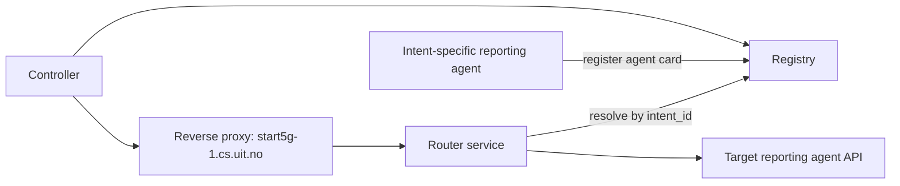

# Reporting Agent Discovery and Routing Design

## Purpose

Define how intent-specific observation reporting agents are discovered and controlled in a generic way by combining:

- A2A-style discovery and registration
- Agent cards with domain metadata
- A reverse proxy on `start5g-1.cs.uit.no`
- A router that resolves `intent_id` to the correct running agent

This enables a controller to send control messages to the correct reporting agent without hardcoding per-agent endpoints.

## Scope

- One reporting agent instance per `intent_id`
- Controller-driven interaction (for example metric span updates, frequency adjustments, trigger instructions)
- Dynamic registration and lookup as agents start and stop
- HTTP-based invocation contract documented with OpenAPI

Out of scope:

- Standardizing a universal "agent control message" protocol across all ecosystems
- Replacing package/domain semantics inside `SimulatorAgentPackages/5g4data-intent-observations`

## Architecture Overview




Core idea:

1. Each agent announces itself to a registry with an agent card.
2. Controller derives the `intent_id` to target (how to handle this is TBD).
3. Controller sends control message via host gateway (`start5g-1.cs.uit.no`).
4. Router resolves the live upstream from registry and forwards the request.
5. No per-agent reverse proxy reconfiguration is required.

## Why A2A Here

A2A (or A2A-style agent discovery) is used for discovery and capability advertisement, not as a replacement for the reporting API contract.

- Discovery responsibility: Which agents exists, what intent it serves, where it is reachable.
- Invocation responsibility: How to call the agent (HTTP endpoints and schemas).

Practical choice:

- Use A2A-compatible card semantics for registration/discovery.
- Use OpenAPI for concrete request/response shapes of control endpoints.

## Agent Identity and Domain Metadata

Each reporting agent is bound to one intent.

- `intentLocalId`: for example `I5e780d6c152f42dc991637ad34cd6a62`
- `intentIri`: for example `http://5g4data.eu/5g4data#I5e780d6c152f42dc991637ad34cd6a62`
- `ontologyNamespace`: `http://5g4data.eu/5g4data#`

Important:

- The `data5g` prefix in Turtle is namespace shorthand, not a built-in prefix in the opaque local id.
- Domain/use-case tagging should use explicit metadata fields (for example `ontologyNamespace`, `useCase`) instead of inferring from local id format.

## Example Agent Card

```json
{
  "a2aVersion": "0.2",
  "agentId": "obs-agent-I5e780d6c152f42dc991637ad34cd6a62",
  "name": "5G4Data Observation Reporter (Intent I5e780...)",
  "endpoint": {
    "baseUrl": "https://start5g-1.cs.uit.no/agents/I5e780d6c152f42dc991637ad34cd6a62",
    "createSessionPath": "/v1/sessions",
    "turnsPath": "/v1/sessions/{sessionId}/turns",
    "openapiUrl": "https://start5g-1.cs.uit.no/agents/I5e780d6c152f42dc991637ad34cd6a62/openapi.json"
  },
  "capabilities": [
    "observation-reporting",
    "runtime-overrides",
    "tmforum-observation-turtle"
  ],
  "domain": {
    "ontologyNamespace": "http://5g4data.eu/5g4data#",
    "useCase": "5g4data-observation-reporting"
  },
  "intentBinding": {
    "intentLocalId": "I5e780d6c152f42dc991637ad34cd6a62",
    "intentIri": "http://5g4data.eu/5g4data#I5e780d6c152f42dc991637ad34cd6a62"
  },
  "routingHints": {
    "metricNamePattern": "<targetProperty>_<conditionId>"
  }
}
```

## Reverse Proxy and Router Responsibilities

### Reverse Proxy (Caddy on `start5g-1.cs.uit.no`)

- Keep static top-level routing only (for example `/agents/*` -> router service).
- Terminate TLS and enforce edge auth policy.
- Do not require per-agent config edits when new agents are created.

### Router Service

- Parse target identifier from path/body (prefer explicit `intent_id`).
- Query registry for active agent card bound to that intent.
- Forward request to resolved upstream endpoint.
- Return clear errors for unknown intent, expired registration, or unhealthy target.

This separation keeps proxy config stable while runtime topology changes dynamically.

## Discovery and Control Flow

### Agent startup flow

1. Agent instance is created for an `intent_id`.
2. Agent posts its card to registry (`register`).
3. Registry stores card with TTL/lease and heartbeat metadata.

### Controller control flow

1. Controller decides which intent/metric needs change.
2. Controller resolves to `intent_id` (directly known or via metric->condition->intent mapping).
3. Controller sends control request to gateway endpoint for that intent.
4. Router resolves active agent from registry and proxies request.
5. Agent processes request and returns response.

## Metric-to-Intent Resolution

Discovery is most robust when keyed by `intent_id`.

If control logic starts from metric names:

- Use naming convention (`<targetProperty>_<conditionId>`) to extract `conditionId`.
- Resolve `conditionId` to `intent_id` using GraphDB.
- Lookup agent by `intent_id` in registry.

Do not assume discovery layer can infer all domain mappings without explicit metadata or resolver logic.

## API Contract Guidance

Use versioned HTTP endpoints and OpenAPI for invocation:

- `POST /v1/sessions`
- `POST /v1/sessions/{id}/turns` with `{ "text": "...", "directives": { ... } }` (if directives channel is enabled)

Recommended control payload content:

- `intent_id`
- Optional structured override fields (`metricValueSpans`, `eventRules`, `timeWindows`)
- Optional natural-language instruction text

## Operational Requirements

- Registry entries should use TTL/heartbeat to remove stale agents.
- Router should implement retries/timeouts/circuit-breaker behavior.
- Enforce one in-flight turn per session in downstream agent API.
- Emit correlation IDs across controller, router, and agent logs.
- Keep auth model explicit in card metadata and OpenAPI.

## Key Decisions

1. A2A-style mechanism is used for discovery and capability advertisement.
2. OpenAPI-defined HTTP remains the invocation standard for control messages.
3. Reverse proxy config remains static; routing dynamism is handled by registry + router.
4. Domain tagging uses explicit namespace/use-case fields (`http://5g4data.eu/5g4data#`), not implicit local-id parsing.
5. Primary lookup key is `intent_id`; metric-driven control must resolve to intent before routing.

