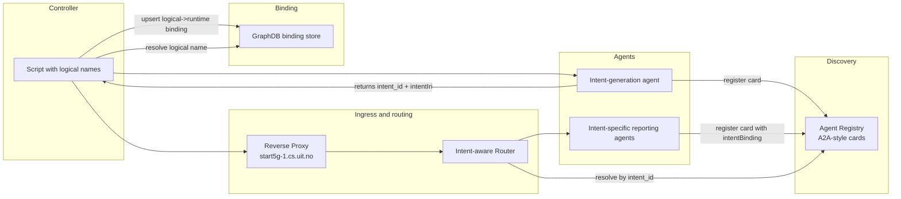

# Multiagent Data Generation Simulator Design

## 1. Background and motivation

The INTEND project needs realistic data to validate and demonstrate integration of extra-functional tools such as inCoord, inSustain, and inExplain in the 5G4Data use-case.

The core idea is to generate this data at the intent abstraction level by simulating:

- intent creation
- intent status reporting
- intent observation reporting

This creates a digital observational twin of the 5G4Data system behavior, suitable for downstream analytics and coordination tooling.

## 2. Hypothesis

Observation of intent-level abstractions is sufficient to support the integration and evaluation of extra-functional tools in the 5G4Data use-case.

## 3. Architectural approach

The simulator is implemented as a multiagent system based on Simulator:

- `SimulatorAgentKernel` is the generic runtime kernel.
- `SimulatorAgentPackages` contain domain-specific behavior.
- Agents are instantiated as package-bound runtime clones (for example `SimulatorAgentKernel-<package-name>`).

This separation keeps reusable mechanics (orchestration, model invocation, validation loops, package loading) in the kernel and domain behavior (prompts, rules, workflows, tools, validators) in packages.

Benefits:

- fast onboarding of new domain agents
- consistent runtime behavior across agents
- lower maintenance cost
- safer evolution via package isolation

## 4. Key design principles

1. **Separation of concerns**
   - Invocation API, discovery, routing, and binding are separate but integrated concerns.
2. **Runtime independence**
   - Controller scripts use logical names, not runtime-generated IDs.
3. **Dynamic topology**
   - Agent instances may start/stop dynamically; discovery and routing must adapt without static config churn.
4. **Contract clarity**
   - OpenAPI defines invocation contracts; discovery cards define discoverability metadata.
5. **Operational durability**
   - Persist state (bindings, registry leases) in external stores, not only in process memory.

## 5. Main agents and roles

### 5.1 Intent-generation agent

- Package: `5g4data-intent-generation`
- One instance per domain/use-case
- Responsibilities:
  - create intents from NL/structured requests
  - register its agent card in registry at startup
  - return `intent_id`, `intentIri`, and correlation/idempotency key on create

### 5.2 Intent-specific observation reporting agents

- Package: `5g4data-intent-observations`
- One instance per created intent
- Responsibilities:
  - generate observation reports from intent + instructions
  - support natural-language and structured follow-up controls
  - register card with explicit `intentBinding` metadata

### 5.3 Controller/orchestrator

- Executes runtime-independent scripts
- Uses logical placeholders for intents
- Discovers and invokes agents
- Owns logical-name binding lifecycle

## 6. End-to-end architecture



## 7. Discovery and agent cards

### 7.1 Why A2A-style discovery

A2A-style registry/card semantics are used for:

- advertisement of available agents
- capability metadata
- endpoint and auth metadata
- intent-to-agent discoverability

Discovery is not used as a replacement for invocation contracts.

### 7.2 Card metadata recommendations

- `agentId`
- `capabilities`
- `domain.useCase`
- `domain.ontologyNamespace` (`http://5g4data.eu/5g4data#`)
- endpoint base URL and OpenAPI URL
- auth requirements
- for reporting agents:
  - `intentBinding.intentLocalId`
  - `intentBinding.intentIri`
  - optional routing hints (for example metric naming pattern)

### 7.3 Namespace guidance

The `data5g` token in Turtle is a prefix alias for namespace `http://5g4data.eu/5g4data#`; it should be treated as explicit domain metadata, not inferred from opaque local IDs.

## 8. API strategy

### 8.1 Invocation API (OpenAPI v1)

Base transport API wraps `TurnOrchestrator.runTurn(...)` and should include:

- `POST /v1/sessions`
- `POST /v1/sessions/{id}/turns`
- optional read-only package metadata routes

Message payloads may carry:

- natural-language instructions
- optional structured control directives (when enabled)

### 8.2 Discovery API

- register card
- heartbeat / lease renewal
- lookup by capability/domain
- lookup by `intent_id`

### 8.3 Binding API (fronting GraphDB)

- `PUT /bindings/{runId}/{logicalName}` (idempotent upsert)
- `GET /bindings/{runId}/{logicalName}` (resolve)
- `GET /bindings?runId=...` (list)
- optional cleanup endpoint

## 9. Binding mechanism design

### 9.1 Problem

Controller scripts use logical names (placeholders) while runtime produces actual `intent_id` values. Later script steps must resolve those placeholders reliably.

### 9.2 Source of truth

GraphDB is the authoritative binding store.

- Controller may keep in-memory cache (L1).
- GraphDB remains durable source of truth (L2).

### 9.3 Ownership decision

- Intent-generation agent creates intents and returns identifiers.
- Controller persists and resolves logical-name bindings.

Rationale:

- logical names are orchestration semantics
- resilient across restarts and multi-controller scenarios
- avoids tight coupling of generation logic with script semantics

### 9.4 Binding key

Primary key is `(runId, logicalName)` to avoid cross-run collisions.

### 9.5 Suggested RDF fields

- `runId`
- `logicalName`
- `intentLocalId`
- `intentRef`
- `status` (`provisioning`, `active`, `failed`, `terminated`)
- `creatorAgentId` (domain-specific stable role id, for example `5g4data-intent-generation-agent`)
- timestamps (`createdAt`, `updatedAt`)
- correlation/idempotency metadata

Example:

```ttl
@prefix data5g: <http://5g4data.eu/5g4data#> .
@prefix dct:    <http://purl.org/dc/terms/> .
@prefix xsd:    <http://www.w3.org/2001/XMLSchema#> .

data5g:binding_run42_avalanche a data5g:IntentBinding ;
  data5g:runId "run42" ;
  data5g:logicalName "avalanche-intent" ;
  data5g:intentLocalId "I5e780d6c152f42dc991637ad34cd6a62" ;
  data5g:intentRef data5g:I5e780d6c152f42dc991637ad34cd6a62 ;
  data5g:status "active" ;
  data5g:creatorAgentId "5g4data-intent-generation-agent" ;
  dct:created "2026-05-05T06:15:00Z"^^xsd:dateTime ;
  dct:modified "2026-05-05T06:15:00Z"^^xsd:dateTime .
```

## 10. Routing model on `start5g-1.cs.uit.no`

### 10.1 Reverse proxy (Caddy)

- static top-level configuration
- TLS termination and edge auth policy
- forward `/agents/*` to router service

No per-agent Caddy update should be required for new reporting agents.

### 10.2 Intent-aware router

- extract intent context from path/body
- resolve active target agent from registry
- proxy request
- provide normalized errors for:
  - unknown intent
  - stale/expired registration
  - unhealthy upstream

## 11. Control flows

### 11.1 Intent creation flow

1. Script step requests creation for logical name `X`.
2. Controller discovers generation agent from registry.
3. Generation agent creates intent and returns `intent_id`/`intentIri`.
4. Controller upserts `(runId, X)` binding in GraphDB.

### 11.2 Reporting control flow (logical name)

1. Script requests control change for logical name `X`.
2. Controller resolves `X -> intent_id` via binding store.
3. Controller sends request through gateway/router.
4. Router resolves `intent_id -> reporting agent` via registry.
5. Reporting agent executes control instruction.

### 11.3 Metric-driven flow

When script starts from metric names:

1. extract `conditionId` from `<targetProperty>_<conditionId>`
2. resolve `conditionId -> intent_id` via graph/index
3. continue as intent-based route

## 12. Reliability, safety, and operations

### 12.1 Required controls

- registry TTL + heartbeat for liveness
- idempotent intent creation requests
- idempotent binding upserts
- per-session in-flight turn guard
- correlation IDs end-to-end
- retries with backoff

### 12.2 Reconciliation jobs

- detect intents created without binding
- detect bindings without active reporting agent
- detect stale cards and dangling routes

### 12.3 Security

- explicit auth in card metadata and OpenAPI
- edge auth/rate limits at reverse proxy
- service-to-service auth between router, registry, and agents

## 13. Trade-offs and decisions

- **A2A-style discovery + OpenAPI invocation** gives clear separation of concerns.
- **GraphDB binding store** provides durability and queryability beyond controller-local maps.
- **Controller-owned binding writes** preserve orchestration ownership boundaries.
- **Static proxy + dynamic router** minimizes operational maintenance.

## 14. Phased implementation plan

### Phase 1: API and discovery baseline

- implement OpenAPI v1 invocation endpoints
- implement registry/card model with lookup and heartbeat
- deploy router behind `start5g-1.cs.uit.no`

### Phase 2: Binding hardening

- implement GraphDB binding vocabulary and binding API
- add idempotency guarantees and retry policies
- add reconciliation routines and error taxonomy

### Phase 3: Scale and advanced features

- external session storage
- horizontal scaling
- optional streaming APIs
- policy-driven routing/security hardening

## 15. Integration with INTEND extra-functional tools

The simulator outputs intent-level artifacts (intents, status reports, observation reports) that downstream tools can consume through metadata-driven queries (for example GraphDB metadata and pointers to detailed metric backends such as GraphDB/Prometheus).

This supports practical integration testing of inCoord, inSustain, and inExplain against a realistic observational twin.

## 16. Final design statement

The simulator adopts a combined architecture:

1. Simulator kernel + package-based domain agents
2. OpenAPI-defined invocation APIs
3. A2A-style registry and agent cards for discovery
4. GraphDB-backed logical-name binding service
5. Static reverse proxy with dynamic intent-aware routing

This design enables runtime-independent controller scripting while preserving clean boundaries between domain behavior, discovery, transport, and operational state.

## 17. Draft example for a controller script

This is a very early draft. The script layout will change when the status report agent is designed (currently only the observation report agent has been discussed), and it will also change when observation report agent capabilities evolve (which is expected).

The example below illustrates the current controller intent:

- use logical names in script steps
- create runtime intents through the generation agent
- persist logical-name bindings in GraphDB
- route observation controls to intent-specific reporting agents

```yaml
scriptId: "winter-drone-search-sim-v1"
runId: "run-2026-05-05-001"
defaults:
  domain: "5g4data"
  ontologyNamespace: "http://5g4data.eu/5g4data#"
  gatewayBaseUrl: "https://start5g-1.cs.uit.no"
  discovery:
    useCase: "5g4data-intent-generation"
  binding:
    mode: "graphdb-authoritative"

steps:
  - id: create_user_intent
    action: create_intent
    logicalIntentName: "avalanche-intent"
    viaDiscovery:
      capability: "intent-generation"
      creatorAgentId: "5g4data-intent-generation-agent"
    request:
      text: >
        I am going to use a drone to search for skiers that might have been caught in an avalange near Bodø/Norway. I need an object detection model deployed locally in a sustainable manner and good network connection for sending 4K video to the model in near realtime.
    onSuccess:
      persistBinding:
        key:
          runIdFromScript: true
          logicalNameFromStep: true
        value:
          fromResponse:
            intentLocalId: "intent_id"
            intentIri: "intentIri"
            correlationId: "creationRequestId"
          status: "active"
          creatorAgentId: "5g4data-intent-generation-agent"

  - id: start_observation_reporting
    action: control_observation_reporting
    target:
      byLogicalIntentName: "avalanche-intent"
      resolveToIntentIdFromBinding: true
    route:
      viaGateway: "https://start5g-1.cs.uit.no"
      viaRouter: true
      lookupReportingAgentBy: "intent_id"
    control:
      text: >
        Use baseline frequency from trigger delays.
        Generate observation reports for deployment and network targets.

  - id: congestion_override_window
    action: control_observation_reporting
    target:
      byLogicalIntentName: "avalanche-intent"
      resolveToIntentIdFromBinding: true
    control:
      directives:
        intent_id: "${resolved.intent_id}"
        eventRules:
          - event: "network-congestion"
            conditionId: "COd1dfd984940a452d89af523502caf9ee"
            min: 250
            max: 700
            durationSeconds: 900
        timeWindows:
          - startTime: "2026-05-05T12:00:00Z"
            endTime: "2026-05-05T12:30:00Z"
            conditionId: "COd1dfd984940a452d89af523502caf9ee"
            min: 300
            max: 800
            frequencySeconds: 30

  - id: metric_based_adjustment
    action: control_observation_reporting
    target:
      fromMetricName: "p99-token-target_COd1dfd984940a452d89af523502caf9ee"
      resolveMetricToIntent:
        strategy: "extract_condition_id_then_graph_lookup"
    control:
      text: "Temporarily reduce sustainability reporting frequency to every 60 seconds."
```

Notes:

- The script is intentionally declarative and runtime-independent.
- `logicalIntentName` is the stable handle used by later control steps.
- Binding persistence occurs immediately after successful intent creation.
- Later steps resolve the runtime `intent_id` through the binding store.
- Metric-driven control is supported by resolving metric/condition context to `intent_id` before routing.
