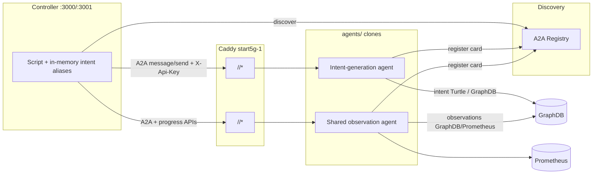

# Multiagent Data Generation Simulator

## 1. Background and motivation

The INTEND project needs realistic data to validate and demonstrate integration of extra-functional tools such as inCoord, inSustain, and inExplain in the 5G4Data use-case.

The core idea is to generate this data at the intent abstraction level by simulating:

- intent creation
- intent status reporting
- intent observation reporting

This creates a digital observational twin of the 5G4Data system behavior, suitable for downstream analytics and coordination tooling.

## 2. Hypothesis

Observation of intent-level abstractions is sufficient to support the integration and evaluation of extra-functional tools in the 5G4Data use-case.

## 3. Architectural approach (current)

The simulator is a multiagent system:

| Piece | Role |
|-------|------|
| `SimulatorAgentKernel` | Stock TypeScript runtime (turns, validation, package load, HTTP/A2A) |
| `SimulatorAgentKernel-mistral.small4` | Experimental kernel for fragmented generation |
| `LangGraphAgents` | Side-by-side LangGraph + LangSmith kernel |
| `SimulatorAgentPackages` / `LangGraphAgents/packages` | Domain packages |
| `agents/<package-name>/` | Runnable clones from `package load` |
| `SimulatorController` | Script orchestration UI/API (:3000 prod, :3001 lab) |
| `a2a-registry` | Agent-card registration and discovery |
| Caddy (`start5g-1.cs.uit.no`) | TLS + static path proxy per agent name |

Reusable mechanics stay in the kernel; prompts, rules, tools, validators, and card metadata stay in packages.

## 4. Key design principles

1. **Separation of concerns** — Invocation (A2A/OpenAPI), discovery (registry), and Controller scripting are separate layers.
2. **Package-driven domains** — New agents are mostly new packages + clones, not new kernels.
3. **Runtime-independent scripts (within a run)** — Scripts use logical intent aliases; Controller maps them to `intent_id` for later steps in the same run.
4. **Contract clarity** — OpenAPI + A2A cards; Controller sends `metadata.simulator` on turns.
5. **Operational practice** — Clones ignored by git (`agents/`); keys synced into Controller/registry `.env` on load.

## 5. Main agents and roles

### 5.1 Intent-generation agents

| Variant | Package / card name | Port |
|---------|---------------------|------|
| Stock | `5g4data-intent-generating-agent` | 3011 |
| Mistral fragmented | `5g4data-intent-mistral-small4-generating-agent` | 3013 |
| LangGraph | `5g4data-intent-langgraph-generating-agent` | 3031 |

Responsibilities: NL → intent Turtle (confirm/OK flow), SHACL/policy validation, optional GraphDB persist, A2A registration.

### 5.2 Observation reporting agents

| Variant | Package folder | Card name | Port |
|---------|----------------|-----------|------|
| Stock | `…-observations-generating-agent` | `5g4data-intent-observation-generating-agent` | 3012 |
| LangGraph | `…-observation-langgraph-…` | `5g4data-intent-observation-langgraph-generating-agent` | 3032 |

**Current model:** shared long-lived agent(s), not one container per intent. Intent identity is passed in A2A/control messages.

### 5.3 Controller / orchestrator

- Discovers agents (registry + optional preferred agent names in UI).
- Runs DSL scripts with `create intent … as <alias>` and `request observation-report …`.
- Holds alias → intent maps **in memory for the script run** (see `ControllerIntentNameBindingDesign.md`).

## 6. End-to-end architecture (current)



## 7. Discovery and agent cards

### 7.1 Why A2A-style discovery

Used for advertisement of available agents, skills/tags (e.g. intent-agent vs observation-agent discovery tasks), public URLs, and auth schemes. Discovery does not replace invocation contracts.

### 7.2 What cards carry today

- `name` (registry key and Caddy path slug)
- `url` / skills / capabilities
- `securitySchemes` (apiKey / `X-Api-Key`)
- Domain/package metadata as implemented in each package’s `metadata/a2a.agent-card.partial.json`

Per-intent `intentBinding` on observation cards is **not** required in the shared-agent model.

### 7.3 Namespace guidance

The `data5g` token in Turtle is a prefix for `http://5g4data.eu/5g4data#`; treat it as explicit domain metadata.

## 8. API strategy (current)

### 8.1 Invocation

- A2A JSON-RPC `message/send` (Controller primary path)
- OpenAPI (`/openapi.json`), health (`/health`)
- Package control extensions (e.g. observation progress/errors, workload preview)

### 8.2 Discovery API

- Registry: register card, list/discover agents
- Controller discover routes for intent-agent / observation-agent

### 8.3 Binding

- **Current:** Controller run-local maps only
- **Future:** GraphDB-backed binding API (documented as future in `ControllerIntentNameBindingDesign.md`)

## 9. Binding mechanism (current vs future)

**Current:** `(script run, intentAlias) → intent_id` in Controller memory.

**Future (not implemented):** GraphDB authoritative `(runId, logicalName)` with Controller-owned upserts, cache, reconciliation.

## 10. Routing on `start5g-1.cs.uit.no`

### Current: static Caddy paths

```text
/<agent-card-name>/*  →  host.docker.internal:<agent-port>
```

Examples: intent stock 3011, observations 3012, LangGraph intent 3031, etc.

New agent **names** need a Caddy entry (and usually a port). Clones that reuse an existing card name reuse that path.

### Future: intent-aware router

Static `/agents/*` → router resolving `intent_id` via registry. **Not** deployed in this lab.

## 11. Control flows (current)

### 11.1 Intent creation

1. Discover intent agent (preferred name optional).
2. A2A dialog / confirm (`OK`).
3. Agent returns Turtle / identifiers.
4. Controller stores alias → `intent_id` for the run.

### 11.2 Observation reporting

1. Discover shared observation agent.
2. Resolve alias → `intent_id` from run maps.
3. A2A `request observation-report` (+ storage hints).
4. Poll `/v1/observation-progress` / errors as needed.

## 12. Reliability, safety, and operations

### Implemented / practical today

- `AGENT_API_KEY` / `AGENT_API_KEYS` sync on `package load`
- Agent registration at container startup
- Docker `extra_hosts` for GraphDB via mlflow-network gateway (`172.30.0.1`) where required
- Controller restart required after new keys are written to `.env`

### Still desirable

- Registry TTL/heartbeat hardening
- End-to-end correlation IDs
- Rate limits
- Durable binding reconciliation

## 13. Trade-offs and decisions

| Choice | Rationale |
|--------|-----------|
| A2A discovery + A2A/OpenAPI invocation | Clear separation |
| Shared observation agent | Simpler ops than per-intent containers |
| Static Caddy paths | Explicit, enough for a small agent set |
| In-memory intent aliases | Enough for lab script runs |
| LangGraphAgents side-by-side | Experiment with LangGraph/LangSmith without replacing stock |

## 14. Phased status

### Done (lab baseline)

- Kernel HTTP/A2A, packages, clones under `agents/`
- Registry + Caddy public URLs
- Controller scripts, preferred agents, prometheus/graphdb observation storage
- LangGraphAgents parallel path (ports 3031–3033)

### Next (optional)

- GraphDB binding store + API
- Dynamic intent router / per-intent reporting agents if needed
- Stronger ops (correlation, rate limits, reconciliation)

## 15. Integration with INTEND extra-functional tools

The simulator outputs intent-level artifacts (intents and observation reports) that downstream tools can consume via GraphDB metadata and pointers to detailed backends (GraphDB or Prometheus). That supports integration testing of inCoord, inSustain, and inExplain against an observational twin.

## 16. Final statement (current)

The running architecture is:

1. Kernel(s) + package-based domain agents cloned to `agents/<name>/`
2. A2A/OpenAPI invocation with API keys
3. A2A registry for discovery
4. Static Caddy routing by agent card name
5. Controller scripts with in-memory intent aliases and a shared observation agent

## 17. Example Controller script shape (current DSL)

Illustrative (exact DSL keywords may vary slightly by Controller version):

```text
discover intent-agent by domain telenor.5g4data as intentGen
discover observation-agent by domain telenor.5g4data as obsAgent

create intent using intentGen storage prometheus prompt "I want to experiment with a small llm near Tromsø/Norway" as llmIntent

# After chat confirms (OK) and Turtle is accepted:
request observation-report using obsAgent for llmIntent …
```

Notes:

- Prefer pinning agents via Controller UI “preferred agent” when multiple intent generators are registered (stock vs LangGraph vs mistral).
- Alias `llmIntent` is resolved only for the current script run unless durable binding is added later.
