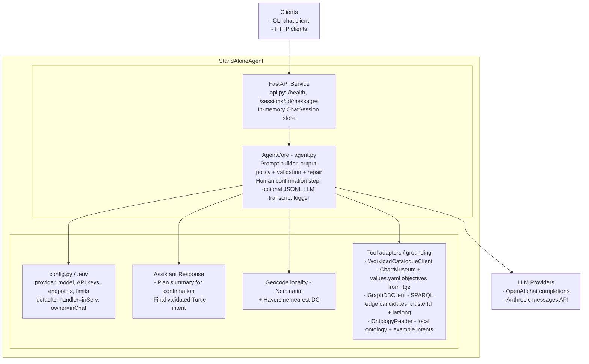

# StandalonePythonAgent Architecture

```mermaid
flowchart TB
  C[Clients\n- CLI chat client\n- HTTP clients]

  subgraph SA[StandAloneAgent]
    direction LR

    subgraph LEFT[ ]
      direction TB
      API[FastAPI Service\napi.py: /health, /sessions/:id/messages\nIn-memory ChatSession store]
      CORE[AgentCore - agent.py\nPrompt builder, output policy + validation + repair\nHuman confirmation step, optional JSONL LLM transcript logger]
      API --> CORE
    end

    subgraph RIGHT[ ]
      direction TB
      CFG[config.py / .env\nprovider, model, API keys, endpoints, limits\ndefaults: handler=inServ, owner=inChat]
      OUT[Assistant Response\n- Plan summary for confirmation\n- Final validated Turtle intent]
      GEO[Geocode locality - Nominatim\n+ Haversine nearest DC]
      TOOLS[Tool adapters / grounding\n- WorkloadCatalogueClient - ChartMuseum + values.yaml objectives from .tgz\n- GraphDBClient - SPARQL edge candidates: clusterId + lat/long\n- OntologyReader - local ontology + example intents]
    end

    CORE --> CFG
    CORE --> OUT
    CORE --> GEO
    CORE --> TOOLS
  end

  LLM[LLM Providers\n- OpenAI chat completions\n- Anthropic messages API]

  C --> API
  CORE --> LLM
```
