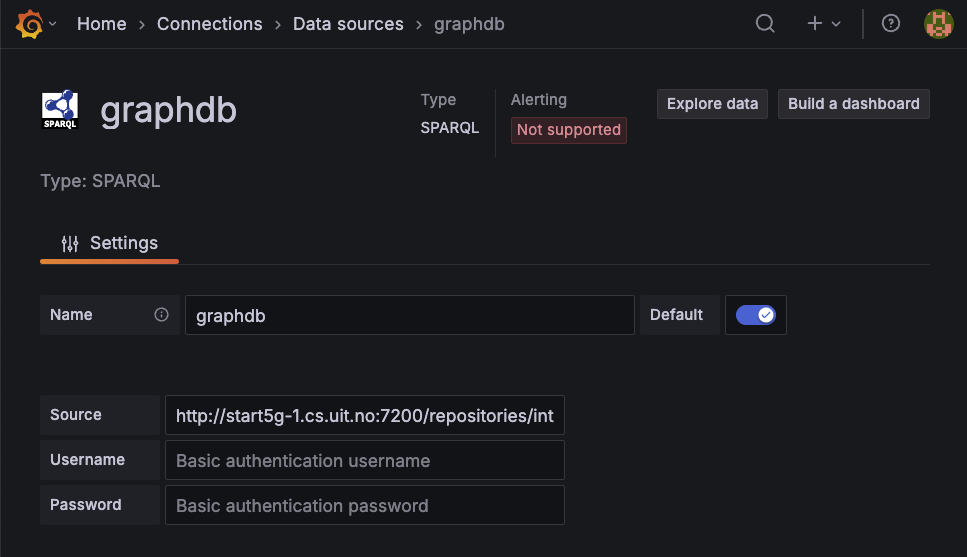
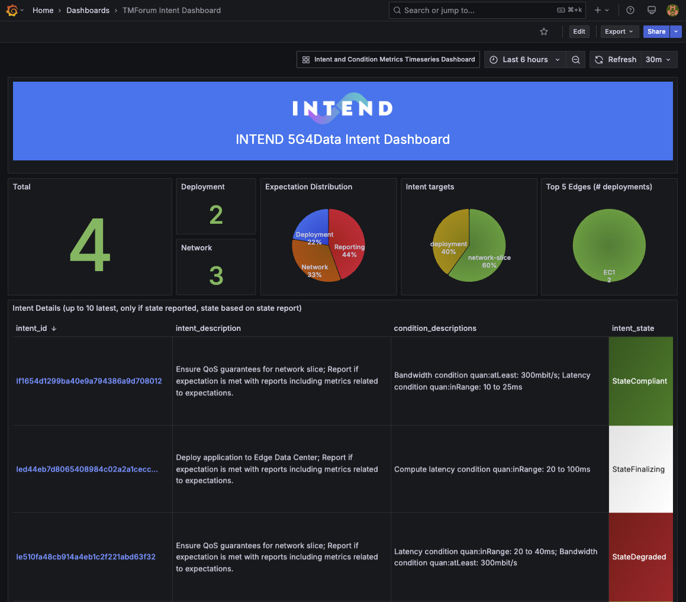
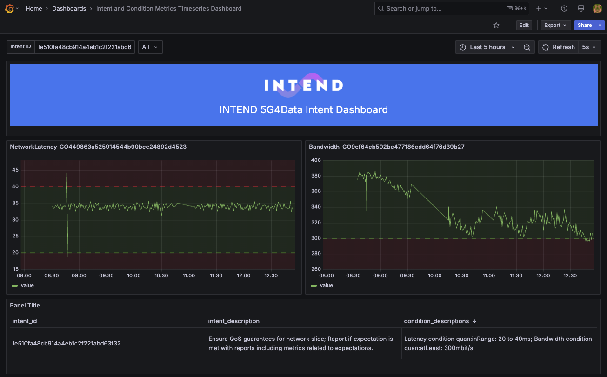

# Install Grafana
The easiest way to run the [Open Source version of Grafana](https://grafana.com/grafana/download?pg=oss-graf&plcmt=hero-btn-1&platform=docker) is to just run the docker image:
```
docker run -d --network=host --name=grafana -e GF_SERVER_HTTP_PORT=3001 grafana/grafana-enterprise
```
Make sure that the port is accessible from outside (i.e. configure your firewall to allow access. e.g. sudo ufw allow from 85.165.51.159 to any port 3001)

# Use Grafana as Dashboard
Let us try to use Grafana as a Dashboard to visualize what is going on with Intents (i.e. How many Intents are there in total, how many are in different states, etc.)

## Add datasource
First we need to add GraphDB as a datasource. There is a SPARQL plugin that we have to install that makes it possible to use any SPARQL endpoint as a data source. It will for example enable sending SPARQL queries to a GraphDB server and make the result of the query available to be visualized in Grafana.


## Dashboards
Panels in the Dashboard can use the graphdb datasource as shown in the figure by refering to it like this:
```
        "datasource": {
          "type": "sparql",
          "uid": "graphdb"
        },
```

# Example dashboards
We have provided a couple of example Dashboards:

<dl>
  <dt><strong>TMForum Intent Dashboard</strong></dt>
  <dd>This Dashboard shows Intent statistics (how many intents in total, how many of each type, their targets and #deployments to each edge datacenter. It also contains a clickable list of intents showing the current TM Forum State and if clicked shows more details (see next Dashboard description).</dd>
  <dt><strong>Intent and Condition Metrics Timeseries Dashboard</strong></dt>
  <dd>This Dashboard shows detailed observation metrics in timeseries graphs for each condition in the selected intent. Dotted threshold lines are also displayed in the graphs based on the quan:function used in the condition.</dd>
</dl>

The json representation of the dashboards (in the src folder) can be imported to a Grafana server and they look like the screenshots below.

We have also created a program to generate relatively realistic synthetic timeseries. The generated synthetic timeseries can be used in the [Intent Report Simulator](https://github.com/INTEND-Project/5G4Data-public/tree/main/IntentReport-Simulator), and the Intent Report Simulator will populate (send) these observations in TM Forum management ontology format to GraphDB. Here are some examples on how to use the synthetic data generator:
```
# Generate Network Bandwidth measurements between 200 and 446
# mbit/s with 20 ms deviation (will simulate daily high/lows
# based on interval)
# The direction decides if high usage periodes during the day
# should result in higher or lower values for the metric
python simulate_values.py --interval 60 --min 200 --max 446 --deviation 20 --seed 46 --type "networkBandwidth" --unit "ms" --direction "down" --period_days 21 --values_only
# Generate Network Latency measurements
python simulate_values.py --interval 60 --min 18 --max 47 --deviation 4 --seed 42 --type "latency" --unit "ms" --direction "up" --period_days 21 --values_only
```

## TMForum Intent Dashboard


## Intent and Condition Metrics Timeseries Dashboard

