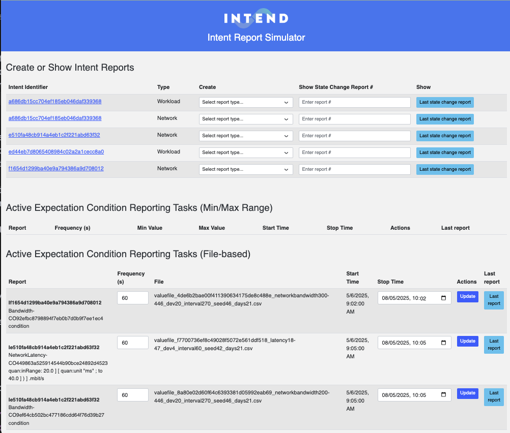

# Intent Report Simulator

A simulator for generating TM Forum formatted intents for the 5G4DATA use case. This tool allows you to generate and store network configuration and workload deployment intents in GraphDB.


## Features

- Create State Reports (if an Intent is Received, Compliant, Degraded or Finalizing)
- Create Observation Reports (metric related to Conditions in the Intent Expectations)
- Randomly generate data between min/max values or using an input file with values
- Store generated intent reports in GraphDB
- View the last State report for Intents
- View the last Observation report for active generator tasks

## Setup

1. Create and activate a Python virtual environment:
```bash
python -m venv intent-report-env
source venv/bin/activate  # On Windows: venv\Scripts\activate
```

2. Install Python dependencies:
```bash
pip install -r requirements.txt
```

3. Configure environment variables:
Create a `.env` file in the root directory with the following arguments and set to match your environment:
```
FLASK_APP=backend/app.py
FLASK_ENV=development
GRAPHDB_URL=http://localhost:7200
```

## Running the Application

1. Start the backend server:
```bash
export PYTHONPATH=$PYTHONPATH:.
flask run # optional add port like this --port 3003
```

2. Open your browser and navigate to `http://localhost:3000` (or other port number, if you changed it)

## Usage
- Select the report type for an intent (in the Create column)
- Set/select the characteristics of the Report in the Intent Report view that pops up.
- Click on the "Genrate Report" button when all input fields have been set/selected.