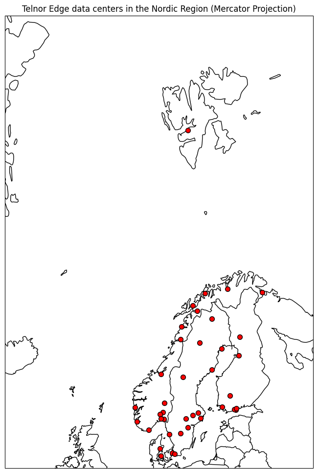

# INTEND-synthetic-data
This repo contains python programs and scripts used to generate synthetic data for the INTEND project 5G4DATA use-case provided by Telenor.

The infrastructure tentatively used in the 5G4DATA use-case is strictly regulated since it is society critical network and compute infrastructure and information about such infrastructure is strictly regulated in the Nordics (and probably elsewere as well). Telenor is therefore not able to use real data for this use-case. The needed infrastructure data to provide end-to-end proof of concepts for this use-case has therefore been synthetically generated. The generated data will resemble real data but will not disclose real infrastructure information. There are several README.md files in the subfolders explaining how the different parts of the synthetic data has been generated.

The most important folders for those seeking information about the infrastructure are the **infrastructure-data**, the **generated-synthetic-data** and the **workload-catalogue-data** folders. The **infrastructure-data** folder contains the specifications for the 40 ege data centers that is part of the infrastructure and the **generated-synthetic-data** folder containts metrics for *latency*, *bandwidth* and *packet error rate* for the network connecting the edge data centers. The **workload-catalogue-data** folder will eventually contain information about workloads that it is possible to deploy to the edge data centers as part of the 5G4DATA use-case. This data is not ready yet as we are discussing how to structure it together with the inOrch/IDO tool from INTEL.

