# INTEND 5G4Data Intent Management System Architecture

## Introduction

The INTEND 5G4Data Intent Management System is a distributed, multi-datacenter orchestration platform that implements the TM Forum TMF921 Intent Management API. The system enables intent-driven workload deployment and network configuration across multiple edge datacenters, with comprehensive reporting and digital twin capabilities.

The architecture follows TM Forum Intent Toolkit specifications, distinguishing between **Intent Owners** (who create intents) and **Intent Handlers** (who process and execute intents). All intent handlers report state and metrics back to intent owners and maintain a digital twin in GraphDB (inGraph) for observability.

## Architecture Diagram

```mermaid
flowchart TD
    %% Top Layer: User
    inChat["inChat<br/>(Intent Owner)"]
    
    %% Second Layer: Routing
    inServ["inServ<br/>(Intent Handler & Router)"]
    
    %% Third Layer: Execution (side by side)
    subgraph EdgeDatacenters["Edge Datacenters"]
        direction TB
        subgraph inOrch1["inOrch EC1"]
            k8s1["Kubernetes Cluster<br/>(EC1-inOrch-TMF-Proxy)"]
            ido1["IDO/Planner"]
            proxy1["inOrch-TMF-Proxy<br/>(Leaf Intent Handler)"]
            k8s1 --> ido1
            k8s1 --> proxy1
        end
        
        subgraph inOrch21["inOrch EC21"]
            k8s21["Kubernetes Cluster<br/>(EC21-inOrch-TMF-Proxy)"]
            ido21["IDO/Planner"]
            proxy21["inOrch-TMF-Proxy<br/>(Leaf Intent Handler)"]
            k8s21 --> ido21
            k8s21 --> proxy21
        end
        
        subgraph inOrchN["inOrch ECn"]
            k8sN["Kubernetes Cluster<br/>(ECn-inOrch-TMF-Proxy)"]
            idoN["IDO/Planner"]
            proxyN["inOrch-TMF-Proxy<br/>(Leaf Intent Handler)"]
            k8sN --> idoN
            k8sN --> proxyN
        end
    end
    
    subgraph NetworkLayer["Network Layer"]
        inNet["inNet<br/>(Leaf Intent Handler)"]
    end
    
    %% Bottom Layers: Data and Observability
    inGraph["inGraph (GraphDB)<br/>(Digital Twin Repository)"]
    grafana["Grafana<br/>(Dashboards)"]
    
    %% Intent Flow - explicit vertical hierarchy
    inChat -->|"1. TMF921 Intent"| inServ
    inServ -->|"2. Query Datacenter URL"| inGraph
    inGraph -->|"3. Return Endpoint"| inServ
    inServ -->|"4a. Workload Intent"| proxy1
    inServ -->|"4b. Workload Intent"| proxy21
    inServ -->|"4c. Workload Intent"| proxyN
    inServ -->|"5. Network Intent"| inNet
    
    %% Reporting Flow (State & Metrics) - back to owner
    proxy1 -->|"Report State/Metrics"| inChat
    proxy21 -->|"Report State/Metrics"| inChat
    proxyN -->|"Report State/Metrics"| inChat
    inNet -->|"Report State/Metrics"| inChat
    inServ -->|"Report State/Metrics"| inChat
    
    %% Digital Twin Storage - all handlers store in inGraph
    proxy1 -->|"Store Intent & Reports"| inGraph
    proxy21 -->|"Store Intent & Reports"| inGraph
    proxyN -->|"Store Intent & Reports"| inGraph
    inNet -->|"Store Intent & Reports"| inGraph
    inServ -->|"Forward Reports"| inGraph
    
    %% Observability
    grafana -->|"SPARQL Queries"| inGraph
    
    style inChat fill:#e1f5ff
    style inServ fill:#fff4e1
    style inGraph fill:#e8f5e9
    style proxy1 fill:#fce4ec
    style proxy21 fill:#fce4ec
    style proxyN fill:#fce4ec
    style inNet fill:#fce4ec
    style grafana fill:#f3e5f5
```



## TM Forum Intent Toolkit Roles

The system implements TM Forum Intent Toolkit specifications with clear role separation:

### Intent Owner
- **Definition**: The entity that creates and owns an intent
- **Responsibilities**: 
  - Creates intents via TMF921 API
  - Receives intent state and metrics reports from handlers
- **Components**: `inChat`

### Intent Handler
- **Definition**: The entity that receives, processes, and executes intents
- **Responsibilities**:
  - Receives intents from owners or other handlers
  - Processes and executes intents
  - Reports intent state and metrics to the intent owner
  - Forwards all reports to inGraph (digital twin)
- **Components**: `inServ`, `inOrch-TMF-Proxy` (in each inOrch), `inNet`

### Leaf Intent Handler
- **Definition**: An intent handler that is the final handler in the chain (does not forward to other handlers)
- **Additional Responsibilities**:
  - Stores the intent itself in inGraph (in addition to reports)
- **Components**: `inOrch-TMF-Proxy` (in each inOrch), `inNet`

## Component Details

### 1. inChat (Intent Owner)

**Role**: Intent Owner only

**Functionality**:
- User interface for creating intents
- Sends TMF921-formatted intents to inServ
- Receives intent state and metrics reports from all intent handlers
- Entry point for intent lifecycle management

**Key Characteristics**:
- Only component that acts as Intent Owner
- Does not process or execute intents
- Monitors intent execution through reports

### 2. inServ (Intent Handler and Router)

**Role**: Intent Handler (acts as handler when receiving from inChat and when forwarding to inOrch/inNet)

**Functionality**:
- Receives TMF921 intents from inChat
- Parses Turtle RDF expressions to extract:
  - DataCenter identifier (e.g., EC21, EC1)
  - Intent type (workload deployment, network configuration, or combined)
- Routes intents based on type:
  - **Workload deployment intents**: Queries inGraph for datacenter TMF921 API endpoint, forwards to appropriate inOrch-TMF-Proxy
  - **Network configuration intents**: Forwards to inNet
  - **Combined intents**: Splits into workload and network parts, routes each accordingly

**Reporting Requirements**:
- Reports intent state and metrics to intent owner (inChat)
- Forwards all reports to inGraph

**Implementation**:
- [`inServ/src/inserv/controllers/intent_controller.py`](../inServ/src/inserv/controllers/intent_controller.py) - Intent creation endpoint
- [`inServ/src/inserv/services/intent_router.py`](../inServ/src/inserv/services/intent_router.py) - Intent routing logic
- [`inServ/src/inserv/services/infrastructure_service.py`](../inServ/src/inserv/services/infrastructure_service.py) - GraphDB queries for datacenter endpoints
- [`inServ/src/inserv/services/turtle_parser.py`](../inServ/src/inserv/services/turtle_parser.py) - Turtle RDF parsing

### 3. inGraph (GraphDB - Digital Twin and Infrastructure Database)

**Role**: Digital Twin Repository

**Functionality**:
- **Infrastructure Data**: Stores datacenter information and TMF921 API endpoints
- **Digital Twin**: Maintains a digital representation of all intents and intent reports at the intent/intent report abstraction level

**Data Stored**:
1. **Infrastructure Data**:
   - Datacenter identifiers (EC1, EC21, etc.)
   - TMF921 API endpoints for each datacenter
   - Network configuration information

2. **Intent Digital Twin**:
   - Intent definitions (stored by leaf handlers)
   - Intent state reports (from all handlers)
   - Intent metrics/observation reports (from all handlers)
   - Intent lifecycle history

**Query Mechanism**:
- SPARQL queries used to retrieve datacenter endpoints
- SPARQL queries used by Grafana to visualize digital twin

**Observability**:
- Grafana dashboards query inGraph via SPARQL to visualize:
  - Intent lifecycle states
  - Intent metrics and performance
  - Intent distribution across datacenters
  - Intent execution history

**Implementation**:
- [`inServ/src/inserv/services/infrastructure_service.py`](../inServ/src/inserv/services/infrastructure_service.py) - Infrastructure queries
- [`inOrch-TMF-Proxy/intent-report-client/intent_report_client/graphdb_client.py`](../intent-report-client/intent_report_client/graphdb_client.py) - Intent and report storage

### 4. inOrch (Leaf Intent Handler - One per Edge Datacenter)

**Role**: Leaf Intent Handler only

**Architecture**:
Each edge datacenter has its own inOrch instance, consisting of:

1. **Kubernetes Cluster**: 
   - Minikube cluster with profile name `{DATACENTER}-inOrch-TMF-Proxy` (e.g., `EC21-inOrch-TMF-Proxy`)
   - Isolated cluster per datacenter
   - Configured with appropriate resources (CPUs, memory)

2. **IDO/Planner**: 
   - Intent Driven Orchestration components installed in the cluster
   - Handles workload orchestration and optimization
   - Manages KPI profiles and intent objectives

3. **inOrch-TMF-Proxy**: 
   - TMF921 API proxy that:
     - Receives TMF Forum formatted intents
     - Transforms them to IDO/Planner specific intents
     - Deploys workloads using Helm charts
     - Creates IDO Intent CRDs for workload management
     - Monitors workload performance via Prometheus

**Reporting Requirements**:
- Reports intent state and metrics to intent owner (inChat)
- Forwards all reports to inGraph
- Stores the intent itself in inGraph (leaf handler requirement)

**Intent Transformation**:
- Parses Turtle RDF expressions to extract:
  - Deployment descriptors (Helm chart URLs)
  - Application names
  - Performance targets (e.g., p99-token-target)
- Creates IDO Intent CRDs with:
  - Target deployments
  - KPI profiles
  - Performance objectives

**Implementation**:
- [`inOrch-TMF-Proxy/src/inorch_tmf_proxy/services/intent_service.py`](../src/inorch_tmf_proxy/services/intent_service.py) - Intent processing
- [`inOrch-TMF-Proxy/src/inorch_tmf_proxy/services/helm_deployer.py`](../src/inorch_tmf_proxy/services/helm_deployer.py) - Helm chart deployment
- [`inOrch-TMF-Proxy/src/inorch_tmf_proxy/services/reporting_service.py`](../src/inorch_tmf_proxy/services/reporting_service.py) - Intent reporting
- [`inOrch-TMF-Proxy/src/inorch_tmf_proxy/services/turtle_parser.py`](../src/inorch_tmf_proxy/services/turtle_parser.py) - Turtle RDF parsing
- [`inOrch-TMF-Proxy/setup-cluster-from-scratch.sh`](../setup-cluster-from-scratch.sh) - Cluster setup automation

### 5. inNet (Leaf Intent Handler - Network Configuration Service)

**Role**: Leaf Intent Handler only

**Functionality**:
- Handles network configuration intents
- Receives network intents from inServ
- Configures network resources based on intent specifications

**Reporting Requirements**:
- Reports intent state and metrics to intent owner (inChat)
- Forwards all reports to inGraph
- Stores the intent itself in inGraph (leaf handler requirement)

**Status**: To be implemented

## Intent Flow

### 1. Intent Creation
1. **inChat** creates a TMF921-formatted intent with:
   - Intent metadata (name, description, priority)
   - Turtle RDF expression containing:
     - DataCenter identifier
     - Intent type (workload, network, or combined)
     - Deployment/configuration specifications

2. **inChat** sends intent to **inServ** via TMF921 API

### 2. Intent Routing
1. **inServ** receives intent and parses Turtle RDF expression
2. **inServ** extracts:
   - DataCenter identifier (e.g., EC21)
   - Intent type (workload, network, or combined)

3. **For Workload Deployment Intents**:
   - **inServ** queries **inGraph** for datacenter TMF921 API endpoint
   - **inGraph** returns endpoint (e.g., `http://start5g-1.cs.uit.no:4021/tmf-api/intentManagement/v5/`)
   - **inServ** forwards intent to appropriate **inOrch-TMF-Proxy**

4. **For Network Configuration Intents**:
   - **inServ** forwards intent directly to **inNet**

5. **For Combined Intents**:
   - **inServ** splits intent into:
     - Workload deployment part → routes to **inOrch-TMF-Proxy**
     - Network configuration part → routes to **inNet**

### 3. Intent Execution
1. **inOrch-TMF-Proxy** (for workload intents):
   - Receives TMF Forum formatted intent
   - Parses Turtle RDF to extract deployment information
   - Transforms intent to IDO Intent CRD format
   - Deploys workload using Helm charts
   - Creates IDO Intent with KPI profiles
   - Monitors workload performance

2. **inNet** (for network intents):
   - Receives network configuration intent
   - Configures network resources accordingly

### 4. Intent Reporting
All intent handlers report throughout the intent lifecycle:

1. **State Reports**:
   - Intent received
   - Intent processing
   - Intent executing
   - Intent completed/failed
   - Reports sent to **inChat** (owner) and **inGraph** (digital twin)

2. **Observation Reports**:
   - Performance metrics
   - Resource utilization
   - KPI measurements
   - Reports sent to **inChat** (owner) and **inGraph** (digital twin)

3. **Intent Storage** (Leaf Handlers Only):
   - **inOrch-TMF-Proxy** stores intent in **inGraph**
   - **inNet** stores intent in **inGraph**

## Reporting and Digital Twin

### Reporting Flow

All intent handlers follow a consistent reporting pattern:

1. **Generate Reports**:
   - State reports: Intent lifecycle state changes
   - Observation reports: Performance metrics and KPIs

2. **Report to Intent Owner**:
   - All handlers send reports to **inChat** (the intent owner)
   - Uses TMF921 Hub/Notification API or direct API calls

3. **Forward to Digital Twin**:
   - All handlers forward reports to **inGraph**
   - Reports stored as Turtle RDF in GraphDB

4. **Store Intent** (Leaf Handlers Only):
   - **inOrch-TMF-Proxy** and **inNet** store the complete intent definition in **inGraph**
   - Enables full digital twin representation

### Digital Twin in inGraph

**Purpose**: Maintain a complete digital representation of the intent management system at the intent/intent report abstraction level.

**Data Model**:
- **Intents**: Complete intent definitions with Turtle RDF expressions
- **Intent Reports**: State and observation reports with timestamps
- **Intent Lifecycle**: Complete history of intent state transitions
- **Intent Metrics**: Performance metrics and KPI measurements
- **Handler Information**: Which handler processed which intent
- **Owner Information**: Intent owner for each intent

**Benefits**:
- **Observability**: Complete view of all intents across all datacenters
- **Historical Analysis**: Track intent execution patterns over time
- **Troubleshooting**: Identify issues in intent processing
- **Performance Monitoring**: Analyze intent execution performance

### Grafana Integration

**Purpose**: Visualize the digital twin stored in inGraph.

**Mechanism**:
- Grafana connects to GraphDB (inGraph)
- Executes SPARQL queries to retrieve intent and report data
- Visualizes data in dashboards showing:
  - Intent lifecycle states across datacenters
  - Intent execution metrics and KPIs
  - Intent distribution by datacenter
  - Intent success/failure rates
  - Performance trends over time

**Example Queries**:
- All intents for a specific datacenter
- Intent state distribution
- Average intent execution time
- Intent failure reasons
- KPI achievement rates

## Intent Types

### 1. Workload Deployment Intents

**Purpose**: Deploy and manage workloads in edge datacenters.

**Characteristics**:
- Contains deployment descriptors (Helm chart URLs)
- Specifies target datacenter
- Includes performance objectives (e.g., p99-token-target)
- Defines application names and namespaces

**Flow**:
1. Created by inChat
2. Routed by inServ to appropriate inOrch-TMF-Proxy
3. Transformed to IDO Intent by inOrch-TMF-Proxy
4. Executed by IDO/Planner in Kubernetes cluster
5. Monitored via Prometheus

### 2. Network Configuration Intents

**Purpose**: Configure network resources and connectivity.

**Characteristics**:
- Contains network configuration specifications
- Defines network topology requirements
- Specifies bandwidth and QoS requirements

**Flow**:
1. Created by inChat
2. Routed by inServ to inNet
3. Executed by inNet
4. Network resources configured accordingly

**Status**: To be implemented

### 3. Combined Intents

**Purpose**: Deploy workloads and configure network simultaneously.

**Characteristics**:
- Contains both workload deployment and network configuration specifications
- Split by inServ into separate intents

**Flow**:
1. Created by inChat
2. Parsed by inServ
3. Split by inServ into:
   - Workload intent → routed to inOrch-TMF-Proxy
   - Network intent → routed to inNet
4. Each part executed independently
5. Reports aggregated for the original combined intent

## Datacenter Configuration

### Datacenter Identification

Datacenters are identified using the format `EC{NUMBER}`, where:
- `EC` = Edge Computing
- `NUMBER` = Datacenter number (e.g., 1, 21, 41)

**Examples**:
- `EC1` = Edge Computing datacenter 1
- `EC21` = Edge Computing datacenter 21
- `EC41` = Edge Computing datacenter 41

### Cluster Profile Naming

Each inOrch cluster uses a profile name indicating its datacenter:
- Format: `{DATACENTER}-inOrch-TMF-Proxy`
- Examples:
  - `EC1-inOrch-TMF-Proxy`
  - `EC21-inOrch-TMF-Proxy`
  - `EC41-inOrch-TMF-Proxy`

### Port Configuration

Ports are calculated based on datacenter number:

1. **External Port** (for port-forwarding):
   - Formula: `4000 + EC_NUMBER`
   - Example: EC21 → port 4021
   - Used for external access to TMF921 API

2. **Proxy NodePort** (Kubernetes service):
   - Formula: `30000 + EC_NUMBER`
   - Example: EC21 → NodePort 30021
   - Used for Kubernetes service exposure

3. **Ingress NodePort**:
   - Formula: `32700 + EC_NUMBER`
   - Example: EC21 → NodePort 32721
   - Used for ingress controller access

### TMF921 API Endpoints

Each datacenter's inOrch-TMF-Proxy exposes its TMF921 API at:
- Format: `http://{HOST}:{EXTERNAL_PORT}/tmf-api/intentManagement/v5/`
- Example (EC21): `http://start5g-1.cs.uit.no:4021/tmf-api/intentManagement/v5/`

Endpoints are stored in inGraph and queried by inServ for routing.

### Setup Automation

The [`setup-cluster-from-scratch.sh`](../setup-cluster-from-scratch.sh) script automates:
- Cluster creation with datacenter-specific profile
- Port configuration based on datacenter number
- IDO/Planner installation
- inOrch-TMF-Proxy deployment
- Port forwarding setup
- Ingress configuration

**Usage**:
```bash
./setup-cluster-from-scratch.sh --datacenter EC21 --ido-repo-path /path/to/ido
```

## API Endpoints

### TMF921 Intent Management API

All components that handle intents implement the TM Forum TMF921 Intent Management API:

**Base Path**: `/tmf-api/intentManagement/v5/`

**Key Endpoints**:
- `POST /intent` - Create intent
- `GET /intent/{id}` - Retrieve intent
- `PATCH /intent/{id}` - Update intent
- `DELETE /intent/{id}` - Delete intent
- `GET /intent` - List intents
- `POST /intentReport` - Create intent report
- `GET /intentReport/{id}` - Retrieve intent report
- `GET /intentReport` - List intent reports

### Component-Specific Endpoints

1. **inChat**: Creates intents via inServ's TMF921 API
2. **inServ**: Exposes TMF921 API, routes to inOrch/inNet
3. **inOrch-TMF-Proxy**: Exposes TMF921 API, processes workload intents
4. **inNet**: Exposes TMF921 API, processes network intents

### Hub/Notification API

Intent handlers use the TMF921 Hub/Notification API to:
- Subscribe to intent events
- Send notifications to intent owners
- Report intent state changes and metrics

## Summary

The INTEND 5G4Data Intent Management System provides a comprehensive, distributed intent management platform that:

1. **Supports Multiple Edge Datacenters**: Each datacenter has its own isolated inOrch instance
2. **Implements TM Forum Standards**: Follows TMF921 API and Intent Toolkit specifications
3. **Provides Intelligent Routing**: inServ routes intents based on type and target datacenter
4. **Maintains Digital Twin**: inGraph stores complete intent and report history for observability
5. **Enables Observability**: Grafana dashboards visualize the digital twin
6. **Supports Intent Lifecycle**: Complete lifecycle management from creation to execution
7. **Reports Comprehensively**: All handlers report state and metrics to owners and digital twin

The architecture ensures scalability, observability, and compliance with industry standards while providing a flexible platform for intent-driven orchestration across edge computing environments.

